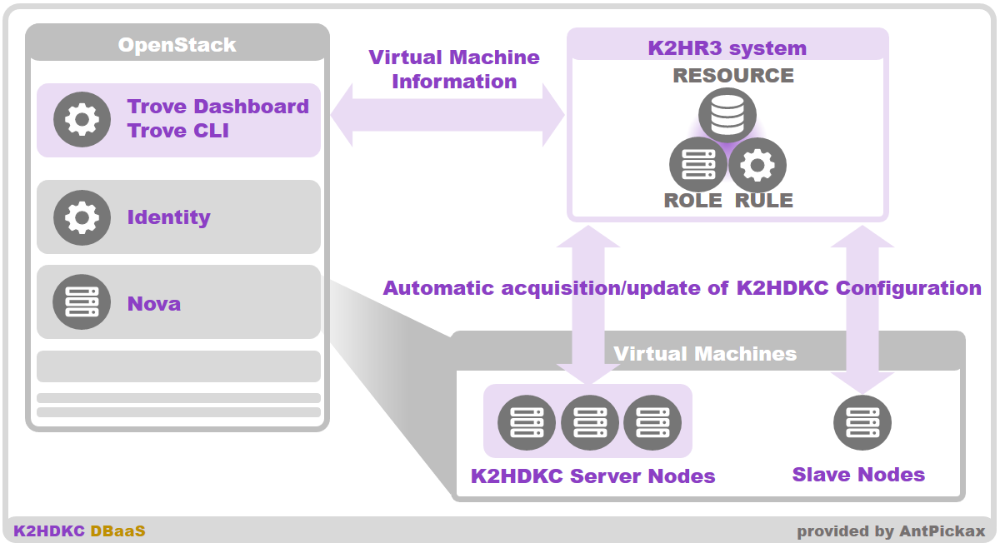
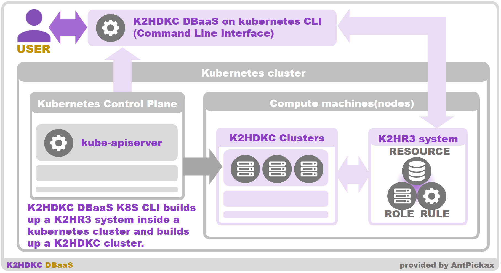
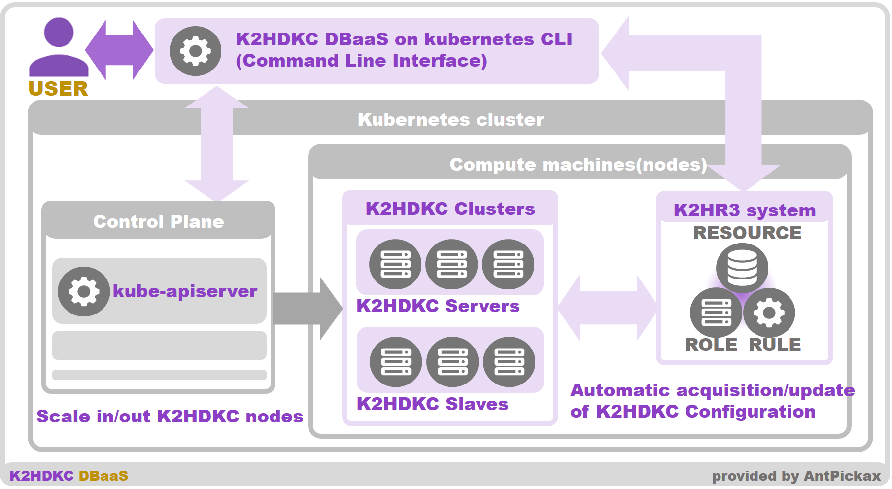

# **K2HDKC DBaaS**
**K2HDKC DBaaS** (Database as a Service for K2HDKC) is a **Database as a Service** that uses [K2HR3](https://k2hr3.antpick.ax/) and works with [OpenStack](https://www.openstack.org/) and [kubernetes](https://kubernetes.io/) to build a [K2HDKC(K2Hash based Distributed Kvs Cluster)](https://k2hdkc.antpick.ax/index.html) Cluster for distributed KVS.

## Background
Yahoo! JAPAN publishes some products as [AntPickax](https://antpick.ax/) as Open Source Software(OSS).  
We planned to provide one of them, [K2HDKC(K2Hash based Distributed Kvs Cluster)](https://k2hdkc.antpick.ax/) as **DBaaS(Database as a Service)** so that anyone can easily use it.  
And the publicly available [K2HR3(K2Hdkc based Resource and Roles and policy Rules)](https://k2hr3.antpick.ax/) offers enough features to make this happen.  
We have built ** DBaaS (Database as a Service)** in conjunction with [OpenStack](https://www.openstack.org/) and [kubernetes](https://kubernetes.io/), centering on this [K2HR3(K2Hdkc based Resource and Roles and policy Rules)](https://k2hr3.antpick.ax/).  

**K2HDKC DBaaS** (Database as a Service for K2HDKC) is configured using the following products which is provided by [AntPickax](https://antpick.ax/index.html).  

### [K2HDKC](https://k2hdkc.antpick.ax/) - K2Hash based Distributed Kvs Cluster
This product is distributed KVS(Key Value Store) clustering system and the core product of **K2HDKC DBaaS**.
### [CHMPX](https://chmpx.antpick.ax/) - Consistent Hashing Mq inProcess data eXchange
This product is communication middleware over the network for sending binary data and an important component responsible for [K2HDKC](https://k2hdkc.antpick.ax/) communication.
### [K2HR3](https://k2hr3.antpick.ax/) - K2Hdkc based Resource and Roles and policy Rules
This is extended RBAC (Role Based Access Control) system, and this system manages the configuration of the **K2HDKC cluster** as a backend for **K2HDKC DBaaS**.

# Overview
**K2HDKC DBaaS** (Database as a Service for K2HDKC) provides the following **two ways** to build **DBaaS(Database as a Service)** for cooperating with [OpenStack](https://www.openstack.org/).  
It also provides the following **one way** for building **DBaaS(Database as a Service)** that cooperating with [kubernetes](https://kubernetes.io/).  

## With Trove(Trove is Database as a Service for OpenStack)
This is **DBaaS(Database as a Service)** using [Trove](https://wiki.openstack.org/wiki/Trove) which is a product of [OpenStack](https://www.openstack.org/).  
It incorporates [K2HDKC](https://k2hdkc.antpick.ax/) (Distributed KVS) as one of Trove's databases to realize **DBaaS(Database as a Service)**.  

## OpenStack and K2HDKC DBaaS CLI(Command Line Interface)
If you have an existing [OpenStack](https://www.openstack.org/) environment, this **K2HDKC DBaaS CLI(Command Line Interface)** allows you to implement **DBaaS(Database as a Service)** without any changes.

## K2HDKC DBaaS on kubernetes CLI(Command Line Interface)
If you are using [kubernetes](https://kubernetes.io/) cluster, this **K2HDKC DBaaS on kubernetes CLI(Command Line Interface)** allows you to implement **DBaaS(Database as a Service)** without any changes.

# Overview - With Trove(Trove is Database as a Service for OpenStack)
**K2HDKC DBaaS**(Database as a Service for K2HDKC) is based on [Trove(Trove is Database as a Service for OpenStack)](https://wiki.openstack.org/wiki/Trove) and works with other [OpenStack](https://www.openstack.org/) components.  

**K2HDKC DBaaS** K2HDKC cluster construction and operation are performed from **Dashboard(Trove Dashboard)** or **Trove CLI(openstack command)**.  
You can use it to build and remove **K2HDKC clusters**, add and remove(scale) server nodes in the cluster, and perform backup and restore operations.  
**K2HDKC DBaaS** also supports the construction of **K2HDKC slave nodes** that can be easily connected to **K2HDKC clusters** and their **automatic configuration**.  

Below is a brief description of the **K2HDKC DBaaS** system.  

## About OpenStack components

**K2HDKC DBaaS** requires OpenStack components.  
The system administrator is responsible for building each component of OpenStack and the entire structure.  
It is also possible to incorporate **K2HDKC DBaaS** into existing your OpenStack system.  
[Trove](https://wiki.openstack.org/wiki/Trove) is one of the OpenStack components, and **K2HDKC DBaaS** is included as one of that Trove's Database.  
In other words, **K2HDKC DBaaS** is a system that extends [K2HDKC](https://k2hdkc.antpick.ax/) to Trove's Database type.  
The basic specifications of **K2HDKC DBaaS** all follow [Trove](https://wiki.openstack.org/wiki/Trove), and you can operate and operate **K2HDKC cluster** as DBaaS by Trove.  

## K2HR3 system
**K2HDKC DBaaS** requires the [K2HR3](https://k2hr3.antpick.ax/) system, which is one of the [AntPickax](https://antpick.ax/) products.  
[K2HR3](https://k2hr3.antpick.ax/) system and Trove work together to provide the DBaaS system.  
[K2HR3](https://k2hr3.antpick.ax/) is designed to work with OpenStack and is used as Trove's backend system.  

[K2HR3](https://k2hr3.antpick.ax/) system must be built in a network that can be accessed from OpenStack components and instances(`Virtual Machine`).  
For example, you can build [K2HR3](https://k2hr3.antpick.ax/) system in instances(`Virtual Machine`s) which are created by OpenStack that works for **K2HDKC DBaaS**.  

## K2HDKC Clusters
**K2HDKC Cluster** is a cluster of K2HDKC that is built by user using **K2HDKC DBaaS**.  
**K2HDKC cluster** is a cluster consisting of multiple K2HDKC server nodes launched on instances(`Virtual Machine`) managed by OpenStack.  
**K2HDKC DBaaS** builds, destroys, and controls(scales, data merges) these K2HDKC clusters.  

## K2HDKC Slave nodes
**K2HDKC slave node** is the client that connects to a K2HDKC cluster(server nodes) created by **K2HDKC DBaaS**.  

You can manually configure and boot the **K2HDKC slave node**.  
In addition, you can easily boot the **K2HDKC slave node** and take advantage of automatic configuration by using the features of **K2HDKC DBaaS**.  
When using **K2HDKC DBaaS** for **K2HDKC slave node**, you starts an instance(`Virtual Machine`) of OpenStack linked with **K2HDKC DBaaS** as a HOST for the slave node of K2HDKC.  
When launching this instance(`Virtual Machine`), you use the `User Data Script for OpenStack` data provided by [K2HR3](https://k2hr3.antpick.ax/).  
This allows the booted instance(`Virtual Machine`) to work with the [K2HR3](https://k2hr3.antpick.ax/) system.  
Ultimately, the configuration and all packages needed to connect to the **K2HDKC cluster** are installed and configured to automate the management of **K2HDKC slave nodes**.  

The **K2HDKC slave node** in this way can automatically perform processing such as connection/disconnection according to the scale of the K2HDKC server node.  

Thus, it hides the configuration of the K2HDK cluster from the user's program on the **K2HDKC slave node**.  
The user program does not need to be aware of the server node configuration, and the load on developers and operators can be reduced.  

# Overview - OpenStack and K2HDKC DBaaS CLI(Command Line Interface)
**DBaaS(Database as a Service)** using **K2HDKC DBaaS CLI**(Command Line Interface) does **not require** [Trove](https://wiki.openstack.org/wiki/Trove) and only works with [OpenStack](https://www.openstack.org/) components.  
In an environment where you already have an [OpenStack](https://www.openstack.org/) environment and it is difficult to incorporate [Trove](https://wiki.openstack.org/wiki/Trove) components, but you can realize the function as **DBaaS(Database as a Service)**.  

All operations such as building a **K2HDKC cluster** with **K2HDKC DBaaS** can be performed from the **K2HDKC DBaaS CLI**.  
You can build and delete K2HDKC clusters, and add/remove(scale) server nodes to the cluster.  
In addition, it supports K2HDKC slave node startup and automatic configuration so that it can be easily connected to and used in the built K2HDKC cluster.  

Below is a rough description of the **K2HDKC DBaaS** system using the **K2HDKC DBaaS CLI**.  

## OpenStack components
**K2HDKC DBaaS CLI** works with [OpenStack](https://www.openstack.org/) components.  
This [OpenStack](https://www.openstack.org/) component assumes an existing system, and ** K2HDKC DBaaS CLI** can be linked as long as the environment can start an instance(`Virtual Machine`).  

## K2HR3 system
Like the Trove type **K2HDKC DBaaS**, this type requires the [K2HR3](https://k2hr3.antpick.ax/) system, which is one of the [AntPickax](https://antpick.ax/index.html) products.  
**K2HDKC DBaaS CLI** operates [K2HR3](https://k2hr3.antpick.ax/) system and [OpenStack](https://www.openstack.org/) components to realize **DBaaS(Database as a Service)** function.  
Also, like the Trove type, the [K2HR3](https://k2hr3.antpick.ax/) system must be built in a network environment that can be accessed by [OpenStack](https://www.openstack.org/) components and instances(`Virtual Machine`).  

## K2HDKC cluster
This is a **K2HDKC cluster** built and launched by the **K2HDKC DBaaS CLI**.  
K2HDKC server nodes are started on multiple instances managed by [OpenStack](https://www.openstack.org/) (`Virtual Machine`) to form a cluster.  
The function of the **K2HDKC DBaaS CLI** is to build, destroy, and control(scaling, merging data) this K2HDKC cluster.  

## K2HDKC slave node
A K2HDKC slave node is a client node that connects to a **K2HDKC cluster**(server nodes) created by the **K2HDKC DBaaS CLI**.  

K2HDKC slave nodes can also be booted using the **K2HDKC DBaaS CLI**.  
And the **K2HDKC DBaaS CLI** supports automatic configuration.  
A K2HDKC slave node is an instance of [OpenStack](https://www.openstack.org/) (`Virtual Machine`) launched by the **K2HDKC DBaaS CLI**.  
The instance of the K2HDKC slave node(`Virtual Machine`) uses the `User Data Script for OpenStack` data provided by [K2HR3](https://k2hr3.antpick.ax/).  
In addition, the K2HDKC slave node instance works with the [K2HR3](https://k2hr3.antpick.ax/) system to automate the K2HDKC configuration required to connect to the K2HDKC cluster and all package installation and initialization required for the K2HDKC slave node.  

Similar to the Trove type, the booted K2HDKC slave node can automate processes such as connecting and disconnecting according to the scale of the K2HDKC server node.  
Then, the K2HDK cluster configuration is hidden from the user's program on the K2HDKC slave node, and the user's program does not need to be aware of the server node configuration, reducing the load on developers and operators.  

# Overview - K2HDKC DBaaS on kubernetes CLI(Command Line Interface)
**K2HDKC DBaaS on kubernetes CLI** makes it easy to build a **K2HDKC** cluster as **DBaaS(Database as a Service)** within a [kubernetes](https://kubernetes.io/) cluster.  

All construction and operation of K2HDKC cluster and [K2HR3](https://k2hr3.antpick.ax/index.html) system as **K2HDKC DBaaS** can be executed from **K2HDKC DBaaS on kubernetes CLI**.  

The [K2HR3](https://k2hr3.antpick.ax/index.html) system required for **K2HDKC DBaaS** must be built in a [kubernetes](https://kubernetes.io/) cluster.  
First of all, build a [K2HR3](https://k2hr3.antpick.ax/index.html) system in a [kubernetes](https://kubernetes.io/) cluster.  
This operation is easy to do using the **K2HDKC DBaaS on kubernetes CLI**.  
**K2HDKC DBaaS on kubernetes CLI** allows you to build and delete [K2HR3](https://k2hr3.antpick.ax/index.html) systems in your [kubernetes](https://kubernetes.io/) cluster.  

Use the built [K2HR3](https://k2hr3.antpick.ax/index.html) system to build and delete the **K2HDKC cluster**.  
**K2HDKC DBaaS on kubernetes CLI** can be used to scale in/out server nodes to a K2HDKC cluster.  
You can scale in/out slave nodes that connect to the built K2HDKC cluster in the same way.  
Automatic configuration and automatic data merging are supported as these operations increase or decrease the number of nodes in the K2HDKC cluster.  

Below is a rough description of the **K2HDKC DBaaS** system using the **K2HDKC DBaaS on kubernetes CLI**.  

## kubernetes control plane
**K2HDKC DBaaS on kubernetes CLI** uses **kube-apiserver** of Control Plane in [kubernetes](https://kubernetes.io/) cluster.  
**K2HDKC DBaaS on kubernetes CLI** can work with existing your [kubernetes](https://kubernetes.io/) clusters.  

At this time, the [kubernetes](https://kubernetes.io/) cluster authentication system only supports [OpenID Connect](https://openid.net/connect/).  

## K2HR3 system
Similar to **K2HDKC DBaaS** which works with [OpenStack](https://www.openstack.org/), this type requires the [K2HR3](https://k2hr3.antpick.ax/) system which is one of the [AntPickax](https://antpick.ax/index.html) products.  
**K2HDKC DBaaS on kubernetes CLI** manipulates [K2HR3](https://k2hr3.antpick.ax/) system and [kubernetes](https://kubernetes.io/) resources to realize **K2HDKC DBaaS** function.  

This [K2HR3](https://k2hr3.antpick.ax/index.html) system must be in a same [kubernetes](https://kubernetes.io/) cluster that builds **K2HDKC DBaaS**.  

You can build the [K2HR3](https://k2hr3.antpick.ax/index.html) system required by **K2HDKC DBaaS** using **K2HDKC DBaaS on kubernetes CLI**.  
The required [K2HR3](https://k2hr3.antpick.ax/index.html) system configuration is set automatically by **K2HDKC DBaaS on kubernetes CLI**.  

It is sufficient to have one [K2HR3](https://k2hr3.antpick.ax/index.html) system in a [kubernetes](https://kubernetes.io/) cluster, but you can build multiple [K2HR3](https://k2hr3.antpick.ax/index.html) systems.  

## K2HDKC cluster
This is a K2HDKC cluster built and launched by the **K2HDKC DBaaS on kubernetes CLI**.  
On **Compute machie(nodes)** in the [kubernetes](https://kubernetes.io/) cluster, each node in the K2HDKC cluster is launched as a container.  

**K2HDKC DBaaS on kubernetes CLI** can be used to create/delete(scale in/out) server nodes and slave nodes of a K2HDKC cluster.  
(You can also scale directly using the **kubectl** command etc.)  

## K2HDKC slave node
This is the slave nodes(clients) that connect to server nodes in K2HDKC cluster created by **K2HDKC DBaaS on kubernetes CLI**.  

K2HDKC slave nodes can also be created and deleted using **K2HDKC DBaaS on kubernetes CLI**.  
And **K2HDKC DBaaS on kubernetes CLI** supports automatic configuration for these nodes.  

The [kubernetes](https://kubernetes.io/) object used to build the K2HDKC slave node is represented as a **yaml file**.  
Users modify this **yaml file template** used by the **K2HDKC DBaaS on kubernetes CLI** and change it to the container they need.  

**K2HDKC DBaaS on kubernetes CLI** hides the K2HDK cluster configuration from the K2HDKC slave node programs, and these programs eliminate the need to be aware of the server node configuration, reducing the load on developers and operators.  
