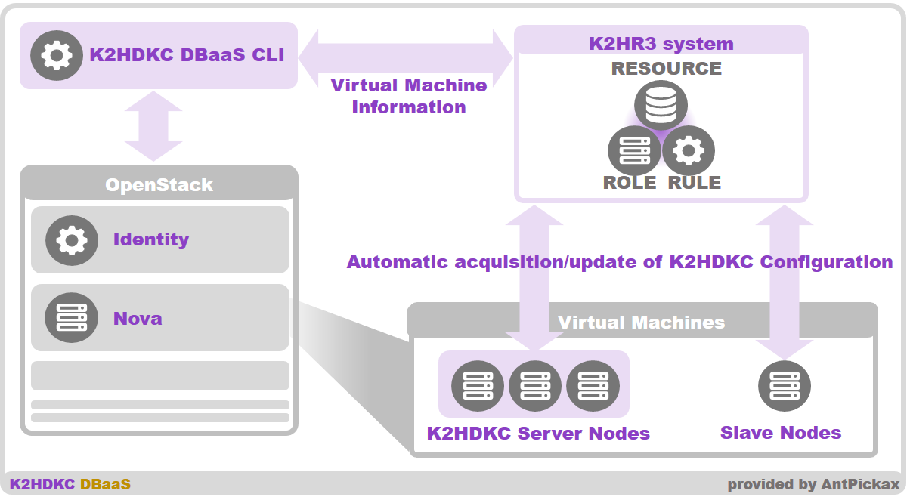

# K2HDKC DBaaS CLI 概要
**K2HDKC DBaaS CLI（Command Line Interface）**を使った**DBaaS（Database as a Service）**は、[Trove(Trove is Database as a Service for OpenStack)](https://wiki.openstack.org/wiki/Trove)を**必要とせず**、[OpenStack](https://www.openstack.org/) のコンポーネントとのみ連携します。  
既に[OpenStack](https://www.openstack.org/)環境を持っており、[Trove(Trove is Database as a Service for OpenStack)](https://wiki.openstack.org/wiki/Trove)コンポーネントを組み込むことが困難な環境において、**DBaaS（Database as a Service）**としての機能を実現できます。  

**K2HDKC DBaaS** でK2HDKCクラスター構築などの操作は、すべてK2HDKC DBaaS CLI（Command Line Interface）から実行できます。  
K2HDKCクラスターの構築、削除、クラスターへサーバーノードの追加・削除（スケール）の操作ができます。  
また、構築した K2HDKCクラスターへ簡単に接続し、利用できるようにするため、K2HDKCスレーブノードの起動、自動コンフィグレーションをサポートします。  

**K2HDKC DBaaS CLI（Command Line Interface）** による**DBaaS（Database as a Service）**の大まかなシステムの説明をします。  

## OpenStack コンポーネント
**K2HDKC DBaaS CLI** は、OpenStackのコンポーネントと連携します。  
このOpenStackのコンポーネントは、既にあるシステムを想定しており、インスタンス（`Virtual Machine`）を起動できる環境であれば、**K2HDKC DBaaS CLI**は連携できます。  

## K2HR3 システム
Troveタイプの **K2HDKC DBaaS**と同様に、[AntPickax](https://antpick.ax/indexja.html)プロダクトの一つである [K2HR3](https://k2hr3.antpick.ax/indexja.html) システムを必要とします。  

**K2HDKC DBaaS CLI**が、[K2HR3](https://k2hr3.antpick.ax/indexja.html) システム、[OpenStack](https://www.openstack.org/)のコンポーネントを操作し、DBaaS機能を実現しています。  

また、Troveタイプと同様に、[K2HR3](https://k2hr3.antpick.ax/indexja.html)システムは、OpenStackのコンポーネントやインスタンス（`Virtual Machine`）からアクセスできるネットワーク環境に構築する必要があります。  
例えば、ネットワーク内で到達できる環境であればよいため、**K2HDKC DBaaS**と連携するOpenStackが作成するインスタンス（`Virtual Machine`）の中で起動することもできます。  

## K2HDKC クラスター
これは、**K2HDKC DBaaS CLI** が構築し、起動するK2HDKCのクラスターです。  
OpenStackの管理する複数のインスタンス（`Virtual Machine`）でK2HDKCサーバーノードが起動され、クラスターを構成します。  
**K2HDKC DBaaS CLI** の機能は、このK2HDKCクラスターの構築、破棄、制御（スケール、データマージ）することです。  

## K2HDKC スレーブノード
**K2HDKC DBaaS CLI**により作成されたK2HDKCクラスター（サーバーノード）に接続するノード（クライアント）のことです。

K2HDKCスレーブノードも、**K2HDKC DBaaS CLI**を使い、起動できます。  
そして、**K2HDKC DBaaS CLI** により、自動的なコンフィグレーションがサポートされます。  
K2HDKCスレーブノードは、**K2HDKC DBaaS CLI** により起動されるOpenStackのインスタンス（`Virtual Machine`）です。  
K2HDKCスレーブノードのインスタンス（`Virtual Machine`）は、[K2HR3](https://k2hr3.antpick.ax/indexja.html)が提供する `User Data Script for OpenStack`データを使用します。  
また、インスタンス（`Virtual Machine`）は、[K2HR3](https://k2hr3.antpick.ax/indexja.html)システムと連動しており、K2HDKCクラスターに接続するために必要なK2HDKC設定や、K2HDKCスレーブノードに必要なすべてのパッケージがインストール・設定され、K2HDKCスレーブノードの管理の自動化ができます。  

Troveタイプと同様に、起動したK2HDKCスレーブノードは、K2HDKCサーバーノードのスケールに応じて、接続・切断などの処理を自動化することができます。  
そして、K2HDKCスレーブノード上のユーザのプログラムから、K2HDKクラスターの構成を隠蔽し、ユーザのプログラムはサーバーノードの構成を意識する必要がなくなり、開発者・運用者の負荷を低減できます。
