# Usage
Describes how to use **K2HDKC DBaaS** (Database as a Service for K2HDKC) that works with [Trove(Trove is Database as a Service for OpenStack)](https://wiki.openstack.org/wiki/Trove).  
This **K2HDKC DBaaS** is a system built into [Trove(Trove is Database as a Service for OpenStack)](https://wiki.openstack.org/wiki/Trove), so you can operate it from the `Trove Dashboard` and [CLI(such as the openstack command)](https://docs.openstack.org/python-openstackclient/latest/).  

The following describes how to create, scale, and delete **K2HDKC clusters** using **K2HDKC DBaaS**.  
In addition, it explains how to start and check the **K2HDKC slave node** automated by using **K2HDKC DBaaS**.  

These are the operating instructions via the `Trove Dashboard`.  
For information on how to use the `CLI(openstack command)`, refer to [Openstack documentation](https://docs.openstack.org/python-openstackclient/latest/).  

You can check the usage explained in this chapter by building **a trial environment** of **K2HDKC DBaaS**.  

The explanation will proceed in the following order.  
1. Access and login to Dashboard
2. Project selection
3. K2HDKC cluster information(**Configuration Group**)
4. Construction of K2HDKC cluster(**two construction methods**)
5. K2HDKC Slave node(start and confirm)

## 1. Access and login to Dashboard
First, go to Trove's Dashboard.  
_If you are using the trial environment, go to the host where you built the K2HDKC DBaaS to access the Dashboard(`http://<hostname or ip address>`)._  


Please login with the user's credentials(user name and passphrase).  
If you are using the trial environment, login with the user name: `demo`.  
_The passphrase for the `demo` user in the trial environment is registered in the `ADMIN_PASSWORD` variable in the `~/devstack/local.conf` file._  

After logging in, the following screen will be displayed.  


### 1-1. Login to K2HR3 system
**K2HDKC DBaaS** uses the K2HR3 system on the backend.  
Please check if you can access the K2HR3 system used from **K2HDKC DBaaS**.  
_If you are using the trial environment, go to the host where you built the K2HDKC DBaaS to access the K2HR3 Web Application(`http://<hostname or ip address>:28080/`)._  

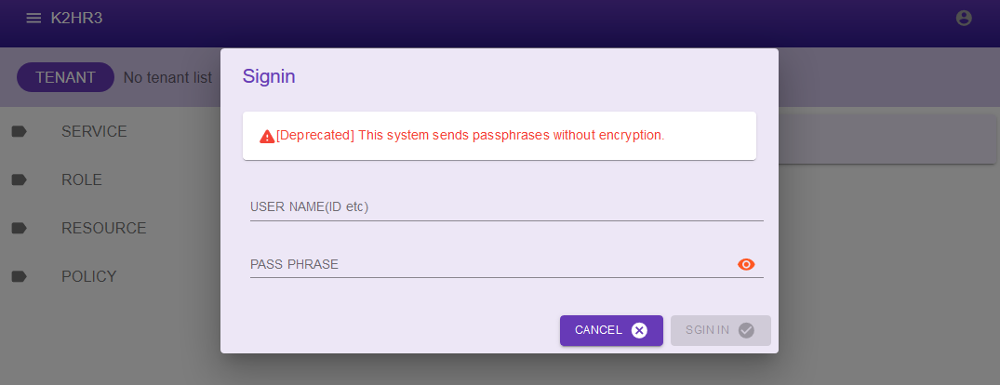

_You do not need to access the K2HR3 system to start and manage your K2HDKC cluster as DBaaS. Access only when starting and managing automatic K2HDKC slave nodes._  

To login to the K2HR3 system, use the credentials(username, passphrase) that login to the Trove Dashboard.  


## 2. Project selection
After logging in to the Dashboard, select the project that manages your K2HDKC cluster.  
_If you are using a trial environment, select the project name:`demo`._  


## 3. K2HDKC cluster information(**Configuration Group**)
In order to configure a K2HDKC cluster using **K2HDKC DBaaS**, you need to configure the cluster.  
This setting is called a `Configuration Group` and you create it.  

Follow the steps below to create it.

### 3-1. Create Configuration Group
Select `Database` > `Configuration Groups` in the Dashboard's left panel.  

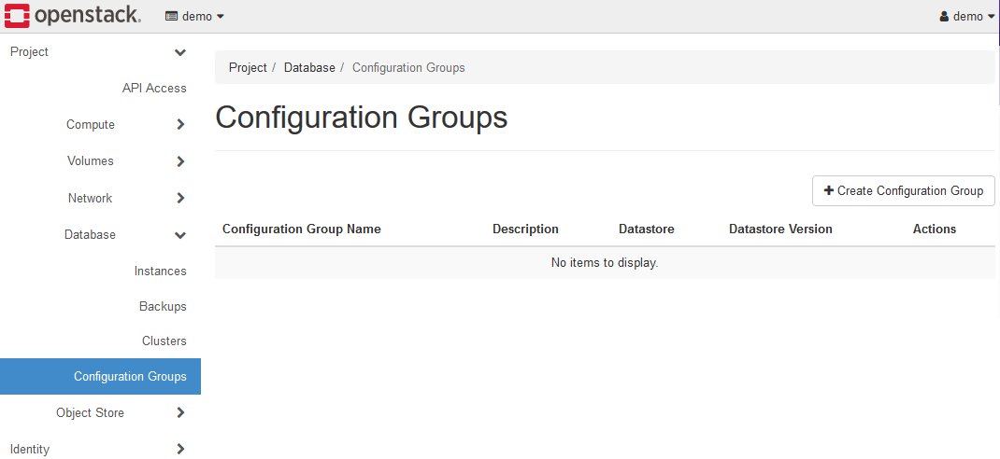

Click the `+Create Configuration Group` button to display the `Create Configuration Group` dialog.  


In this example, Name:`mycluster_configurationgroup`.  
Click the `Create Configuration Group` button to create a `Configuration Group`.  

### 3-2. Set Configuration Group parameter
The created Configuration Group:`mycluster_configurationgroup` will be displayed, so set the details.  


Clicking the link will take you to the parameter setting screen for this `Configuration Group`.  


Click the `+Add Parameter` button to display the `Add Parameter` dialog.  


The minimum parameter to set in **K2HDKC DBaaS** is **only** **cluster-name**.  

Select `cluster-name` parameter name and set the value for it.  
In this example, set `mycluster`.  
_`extdata-url` **must not be set**. This value is set automatically._  


The following is a screen image after setting the `cluster-name` parameter.  


Finally, click the `Apply Changes` button to apply the settings.  


When the settings are reflected, all parameters that have not been set are automatically completed.  
_Unless you have a specific reason, setting only the `cluster-name` parameter is sufficient._  

With the above operation, the setting of K2HDKC cluster information(`Configuration Group`) is completed.  

## 4. Construction of K2HDKC cluster
**K2HDKC DBaaS** offers **2 ways** for building K2HDKC clusters.  
One is that it can build a cluster by specifying the cluster name and the number of server nodes, and grow/shrink/delete the cluster.  
The other is to start the server nodes of the cluster individually and build the cluster.  

In the latter case, you can make backup and create the server node from the backup data(restore).  
However, K2HDKC clusters do not require backup and restore operations because the server nodes internally hold and multiplex each other server's data.  
You can substitute these operations(backup/restore) by shrinking or growing the cluster each time.  
Even with the method shown at the beginning, **K2HDKC DBaaS** provides sufficient data multiplexing(server node multiplexing), so the cluster can be operated safely.  

### 4-1. Bulk Operation
This section provides steps to build a K2HDKC cluster in bulk as one of operations.  

Open `Database` > `Clusters` in left panel.


Click the `Launch Cluster` button to display the `Launch Cluster` dialog and set each parameter.  


Set each parameter as follows.  
- Cluster Name  
This value is used as part of the HOST(`Virtual Machine`) name for the server node of the K2HDKC cluster. In the sample above, it is set `mycluster`.
- Datastore  
The names given to the `Trove guest OS image` such as `k2hdkc - 0.9.30` are listed, so select the one that exists.
- Flavor  
Select a flavor. If you are using a trial environment, select `ds1G`.
- Network  
Select `private` for a trial environment.
- Volume Size  
Set `1` for a trial environment.
- Locality  
Select `None` for a trial environment.
- ConfigurationGroup  
The `Configuration Group` you created is listed. If you have followed the steps so far, select `mycluster_configurationgroup (k2hdkc-0.9.30)`.
- Number of Instances  
Specifies the number of server nodes in the K2HDKC cluster to boot. The default is `3`.

After setting all the parameters as above, click the `Start` button to start the K2HDKC cluster.  

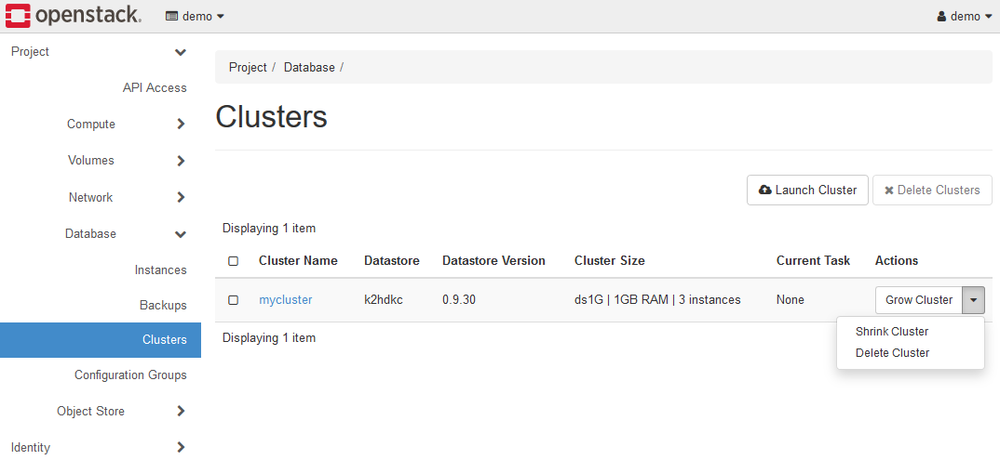

From the menu of the started cluster, you can grow(`Grow Cluster`), shrink(`Shrink Cluster`), and delete(`Delete Cluster`) the cluster.  

#### 4-1-1. Checking the status of cluster
You can check the status of the server node of the K2HDKC cluster by clicking the `Cluster Name` link(`mycluster` in the figure above).  


You can view information about the server nodes that make up the K2HDKC cluster by opening the `Instances` tab.  


#### 4-1-2. Grow cluster
You can grow the K2HDKC cluster(add server nodes) by selecting the `Grow Cluster` menu.  


Click the `Add Instance` button above to display the `Add Instance` dialog and set each parameter.  


Set each parameter as follows.  
- Flavor  
Select a flavor. Make sure to select the same one as the other server nodes.
- Volume Size  
Make sure to select the same one as the other server nodes. Set it to `1` for a trial environment.
- Name  
Specify the name of the HOST(`Virtual Machine`) of the server node to be added. In the above figure, it is set to `mycluster-member-4` according to the existing server node.
- Instance Type / Related To  
Do not need to set these parameters.
- Network  
Make sure to select the same one as the other server nodes. Select `private` for a trial environment.
- ConfigurationGroup  
Make sure to select the same one as the other server nodes. If you have followed the steps so far, select `mycluster_configurationgroup (k2hdkc-0.9.30)`.

After setting all the parameters, click the `Add` button.  
If you want to add multiple server nodes at the same time, repeat this `Add Instance` work for each additional one.  


When the work is completed, it will look like the figure above.  
In this state, the K2HDKC cluster has not been grown yet.  
In other words, this means that we have prepared the information of the server node to be grown.  

Click the `+ Grow Cluster` button to grow the K2HDKC cluster(add server nodes).  

When server nodes are added, the K2HDKC cluster will automatically relocate the internal data.(**Auto Data Merging**)  
It also automatically manages the configuration of the K2HDKC cluster.(**Auto scaling out**)  

To grow the cluster, the user only has to instruct. No work is required to grow the cluster.  

#### 4-1-3. Shrink cluster
You can shrink the K2HDKC cluster(remove the server nodes) by selecting the `Shrink Cluster` menu.  


Select the server node you want to delete and click the `Shrink Cluster` button.  

If the server node is deleted, the K2HDKC cluster will automatically relocate the internal data.(**Auto Data Merging**)  
And, configuration management for K2HDKC clusters is also automatic.(**Auto scaling in**)  

To shrink the cluster, the user only has to instruct as same as growing cluster. No work is required to shrink the cluster.  

####  4-1-4. Delete cluster
Select `Delete Cluster` menu to delete the K2HDKC cluster.  
All server nodes that make up the K2HDKC cluster will be deleted.  

### 4-2. Operate server nodes individually
This section describes the procedure for starting a K2HDKC cluster by launching instances of server nodes one by one and making up it as a K2HDKC cluster.  

Open `Database` >`Instances` in the left panel.  


Click the `Launch Instance` button to display the `Launch Instance` dialog and set each parameter.  
The `Launch Instance` dialog is divided into several tabs, so we will explain each tab.  


Set each parameter on the `Details` tab as follows.  
- Availability Zone  
Specify the Availability Zone. Select `nova` for a trial environment.
- Instance Name  
Specifies the name of the instance of the server node. In this example, it is `server-node-1`.
- Volume Size  
Set `1` for a trial environment.
- Volume Type  
Select `lvmdriver-1` for a trial environment.
- Datastore  
The names given to the `Trove guest OS image` such as `k2hdkc - 0.9.30` are listed, so select the one that exists.
- Flavor  
Select a flavor. If you are using a trial environment, select `ds1G`.
- Locality  
Select `None` for a trial environment.

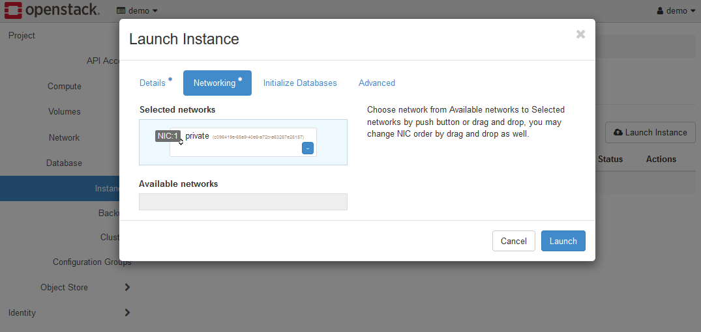

Set each parameter on the `Networking` tab as follows.  
- Selected Networks  
`private` is selected. If you are using a trial environment, leave it as is.


Leave each item on the `Initializing Databases` tab unset.  
_There are no parameters that need to be set._  


Set each parameter on the `Advanced` tab as follows.  
- ConfigurationGroup  
If you have followed the steps so far, select `mycluster_configurationgroup (k2hdkc-0.9.30)`.
- Source for initial state  
Leave it as `None`.

After setting all the tabs, click the `Launch` button to launch one server node for the K2HDKC cluster.  
This boots one server node and puts it in the K2HDKC cluster.  
Launch as many instances as you need for your K2HDKC cluster in sequence.  

In this example, the K2HDKC cluster that finally booted the three server nodes will look like the figure below.  

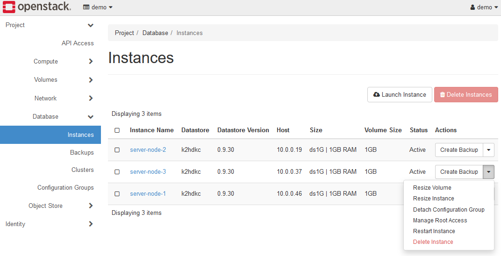

As mentioned above, you have built a K2HDKC cluster consisting of three server nodes.  
This procedure allows you to sequentially start the server nodes and configure the cluster while growing the K2HDKC cluster.  

Server nodes are added sequentially, but the K2HDKC cluster automatically relocates internal data so you don't have to manipulate the data.(**Auto Data Merging**)  
It also automatically manages the configuration of the K2HDKC cluster.(**Auto scaling out**)  

If you select the menu `Detach Configuration Group` menu in each instance of `Instances` in the above figure, you can delete the server node from the K2HDKC cluster(shrink the K2HDKC cluster).  
In this operation, the instance of the server node is not shutdown, that  is kept running.  
For the `Delete Instance` menu(or button), delete the instance(delete the server node) and shrink the K2HDKC cluster.  
In this case, the instance itself is deleted.  
The `Create backup` menu creates a backup of the K2HDKC data held by that instance(server node).  
_These operations explanations will be described later._  
Note that the `Resize Volume`, `Resize Instance`, `Manage Root Access`, and `Restart Instance` menus are not used in **K2HDKC DBaaS**.  

#### 4-2-1. Checking the status of the server node
From the instance list screen, click `Instance Name` to display the instance information.  


In **K2HDKC DBaaS**, only the `Overview` tab works.  
_Other tabs are unnecessary information for K2HDKC and are not working._  

The `Overview` tab shows the ID of the `Configuration Group`.  
To see which K2HDKC cluster the server node built from the instance belongs to, look at the value of `Configuration Group`.  

#### 4-2-2. Delete the server node from cluster
If you want to remove an instance(server node) from a K2HDKC cluster(shrink K2HDKC cluster), use the `Detach Configuration Group` menu.  


Instances that have been deleted(detached `Configuration Group`) from the K2HDKC cluster will be in the above state.  
Unlike the instances that are members of the K2HDKC cluster(Attached `Configuration Group`), the ID of `Configuration Group` no longer exists.  

The instance in this state is running as a server node of K2HDKC, but does not belong to any K2HDKC cluster.  

For such instances, the menu items in the instance list are as follows.  

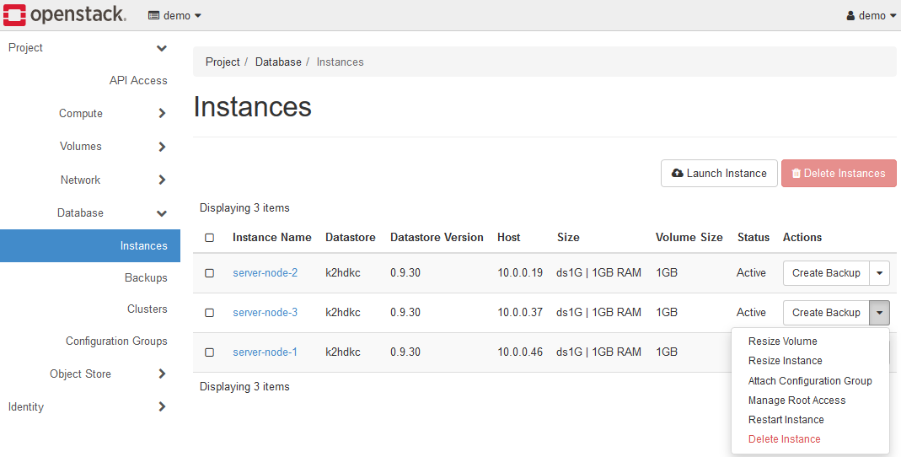

The `Detach Configuration Group` disappears from the menu and switches to the `Attach Configuration Group`.  

#### 4-2-3. Add the server node to cluster
Instances that do not belong to the K2HDKC cluster as described above can be added to the K2HDKC cluster.  
You can grow the K2HDKC cluster by the following operations.  

Select the `Attach Configuration Group` menu to open the `Attach Configuration Group` dialog.  

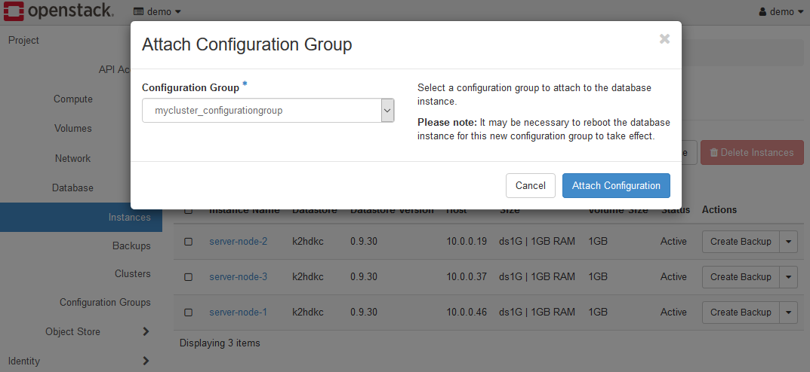

For the value of the `Configuration Group` parameter, select the `Configuration Group` used by the K2HDKC cluster you want to grow.  
Click the `Attach Configuration Group` button to add this instance to your K2HDKC cluster.  

#### 4-2-4. Backup
You can create a backup of an instance(server node) that belongs to a K2HDKC cluster.  
Select the `Create Backup` menu for the instance(server node) you want to back up.  


The `Backup Database` dialog will be displayed, so set each parameter.  
- Name  
A name that distinguishes the backup data.
- Database Instance  
Select the instance(server node) you want to back up.
- Description  
Enter the attached information to be given to the backup data.
- Parent Backup  
There is no differential backup in **K2HDKC DBaaS**. Please leave it blank.

After setting the parameters, click the `Backup` button.  

If the backup is created successfully, go to the `Database` > `Backups` panel.  

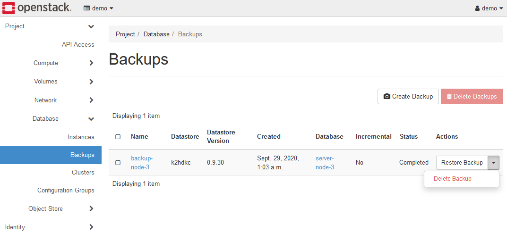

This screen displays a list of backup data.  
Each backup has a menu of `Delete Backup` and `Restore Backup`.  
You can see the details of the backup data by clicking the `Name` of the backed up data.  

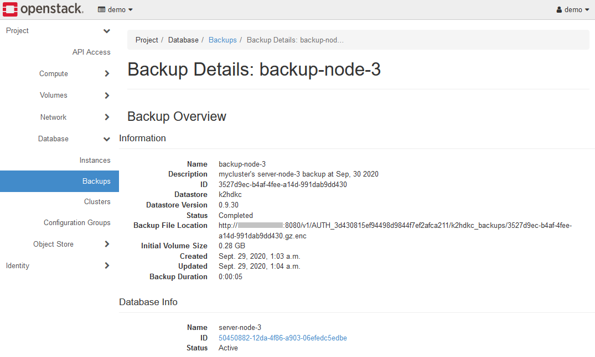

The backup data is stored in the `Object Store`, which is one of the OpenStack components that works with **K2HDKC DBaaS**.  
Open `Object Store` > `Containers` and select the `k2hdkc backups` container.  
_It may differ from the above depending on your OpenStack._  


Like this screen, the created backup files(`.gz.enc` files) are listed.  
Backups created with **K2HDKC DBaaS** are stored in the `Object Store`.  
See the OpenStack documentation for how to use the `Object Store`.  
_[Swift](https://docs.openstack.org/swift/latest/) documentation will be helpful._  

#### 4-2-5. Restore
You can start an instance(server node) by specifying the backup data from the `Restore Backup` menu of the backup data displayed on the `Database` > `Backups` screen.  
You can restore the backup data as the initial data for an instance(server node) and launch that instance.  

After selecting the `Restore Backup` menu, `Launch Instance` dialog is displayed.  
This dialog is the same dialog as launching an instance above.  
However, the settings on the `Advanced` tab are different.  

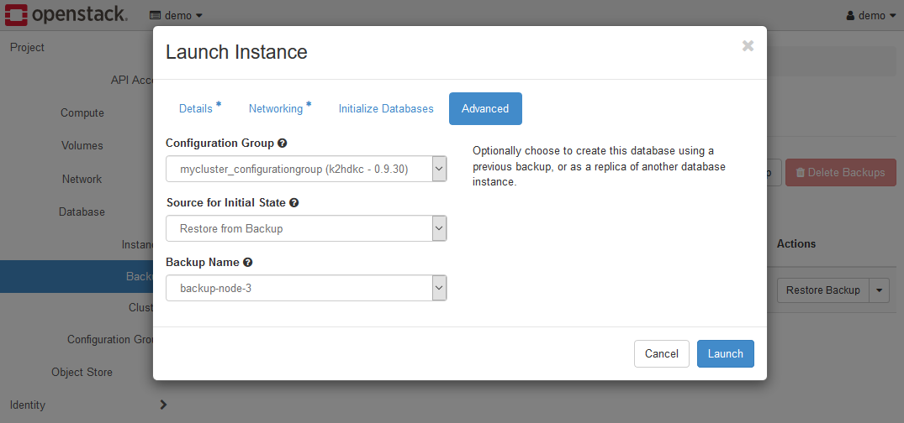

The above is the `Advanced` tab of the` Launch Instance` dialog.  
Set each parameter on the `Advanced` tab as follows.  
- ConfigurationGroup  
Select the same `Configuration Group` as the K2HDKC cluster to which the instance you want to launch belongs.
- Source for initial state  
Select `Restore from Backup`.
- Backup Name  
Select the backup data to be used for restoration.

Set the parameters of the `Details`,` Networking`, and `Initialize Databases` tabs in the same value as when starting the instance.  

After setting everything, click the `Launch` button to launch the instance(server node) with the backup data restored.  

## 5. K2HDKC Slave node
Describes the **K2HDKC slave node** that accesses the K2HDKC cluster built with **K2HDKC DBaaS**.  
_K2HDKC Slave nodes should run on an OS supported by [K2HDKC](https://k2hdkc.antpick.ax/)._  

With the features provided by **K2HDKC DBaaS**, **K2HDKC slave nodes** can flexibly support the configuration of K2HDKC clusters.  
For example, if the K2HDKC cluster is grown or shrunk, the change can be automatically detected and the **K2HDKC slave node** settings can be updated automatically.(**Auto Configuration**)  

This section describes the startup and operation of the **K2HDKC slave node** using the **K2HDKC DBaaS** function.  

### 5-1. Get User Data Script from K2HR3
Access the [K2HR3](https://k2hr3.antpick.ax/) system running on the backend to boot the **K2HDKC slave node** with the features of **K2HDKC DBaaS**.  
_This explanation assumes K2HDKC DBaaS built as a trial environment._  

`User Data Script` is required to launch the **K2HDKC slave node** using the **K2HDKC DBaaS** function.  
Follow the steps below to get the `User Data Script` from the K2HR3 system.  

#### 5-1-1. Login to K2HR3 system
Login to the [K2HR3](https://k2hr3.antpick.ax/) system running on the backend and select the same project(tenant) as your K2HDKC cluster.  
_If you are using the trial environment, login as user:`demo` and select project(tenant):`demo`._  


The above is the screen after selecting the project(tenant).  

#### 5-1-2. Create ROLE token
Select `ROLE`, then select the ROLE name with the same name as the K2HDKC cluster, and then select its child element `slave`.  
_If you have created a K2HDKC cluster using the steps above, select `ROLE` > `mycluster` > `slave`._  

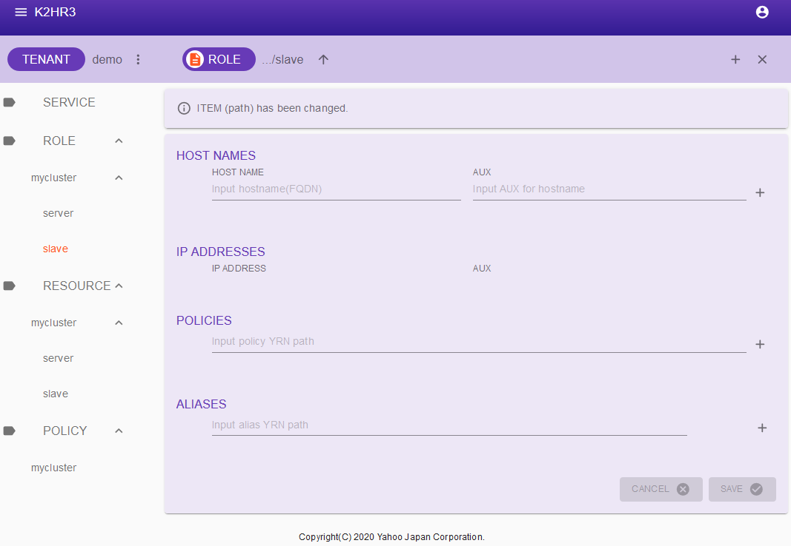

This `slave` ROLE is a ROLE for K2HDKC slave nodes.  
Click the `ROLE` button on the toolbar at the top of this screen.  


The `Selected Path Information` dialog will be displayed.  
Click the` Manage role tokens` link.  


This dialog shows a list of ROLE tokens issued by K2HR3 for the selected ROLE(`ROLE` > `mycluster` > `slave`).  

Generate a new ROLE token.  
_If it has already been generated, proceed to the next step._  


Click the `+` button next to the `Action` character to pop up the `CREATE NEW ROLE TOKEN`.  
In this pop-up dialog, check the `Set the expiration date to the longest` checkbox and click the `CREATE` button.  
_Determine the expiration date of the ROLE token according to your purpose._  


A new ROLE token will be generated and listed.  

#### 5-1-3. Get User Data Script
Click the second button in the `Action` column of the generated ROLE token(or an existing ROLE token).  


The `Role token/Registration code` dialog is displayed.  
Select `User Data Script for OpenStack` from the `Registration code` pull-down list.  
The value of `User Data Script` will be displayed in the text box. Use the `Copy to clip board` button etc. to copy the contents.  

### 5-2. Launch K2HDKC slave node
Use `User Data Script` to launch the K2HDKC slave node.  
The K2HDKC slave node launches as a regular instance of OpenStack.  

The K2HDKC slave node uses a dedicated control port to communicate with the K2HDKC server node.  
For this reason, some pre-configuration is required to launch the instance.  
In the following procedure, we will explain including the pre-configuration settings.  
_The trial environment already set pre-configuration, so proceed to the previous step._  

To proceed, login to Trove Dashboard and select the same project as your K2HDKC cluster.  

#### 5-2-1. Pre-configuration for K2HDKC slave node
Open `Compute` > `Images` in the left panel.
Make sure that the OS image for launching the K2HDKC slave node exists.  
_Please use an OS supported by [K2HDKC](https://k2hdkc.antpick.ax/)._  
As for the trial environment, there is an Ubuntu 18.04 image called `k2hdkc-dbaas-k2hr3-ubuntu-1804`, so use this.  


Then add a security group to allow a dedicated control port for the K2HDKC slave node to access.  


Register the TCP 8031 port with ANY as described above.  
The steps in this document use SSH login, so register the TCP 22(SSH) port as well.  
If you are using the trial environment, the security group `k2hdkc-slave-sec` is registered in advance, so this registration is not necessary.  

You can check the registered security groups in `Network` > `Security Groups`.  

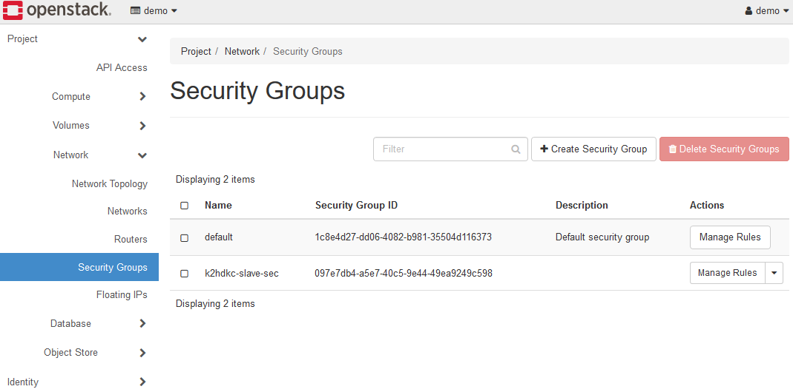

This completes the pre-configuration settings.  

#### 5-2-2. Launch K2HDKC slave node
Select `Compute` > `instances` in the left panel.  
_Please note that it is not `Database` > `Instances`._  


Click the `Launch Instance` button to display the` Launch Instance` dialog.  


Set in the same way as normal instance launching.  
The settings related to the K2HDKC slave node on each page are shown below.  
- Details  
Please set the instance name etc. There are no parameters specifically for K2HDKC slave nodes.
- Source  
Select the OS image for the K2HDKC slave node. For a trial environment, select `k2hdkc-dbaas-k2hr3-ubuntu-1804`.
- Flavor  
Select the flavor according to the prepared OS image. Select `ds1G` for a trial environment.
- Networks  
Please set according to the environment. For a trial environment, leave `private` selected.
- Security Groups  
Select a security group for the K2HDKC slave node. For a trial environment, select `k2hdkc-slave-sec`.
- Key Pair  
Please set if you want to login.
- Network Ports / Server Groups / Scheduler Hints / Metadata  
Please set according to your environment. For a trial environment, leave it unset.
- Configuration  
Set the value of `User Data Script` got from K2HR3.

The important thing to launching an instance is the settings on the `Configuration` page.  
Set the value of `User Data Script` got from K2HR3 as shown below.  

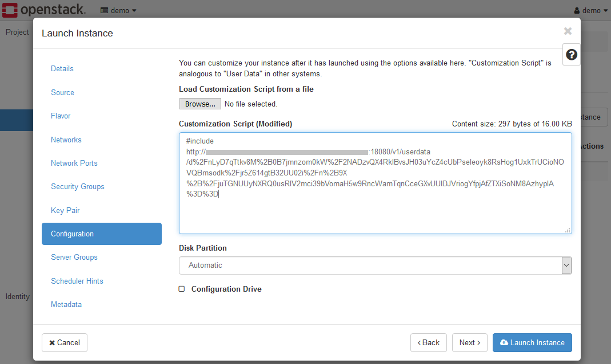

After setting everything, click the `Launch` button to launch the instance.  


### 5-3. Check K2HDKC slave node
After the instance is launched, check the status of the K2HDKC slave node.  
The instance has been launched for the K2HDKC slave node in the following states.  

- The programs required as K2HDKC slave node are installed.
- The configuration file for K2HDKC slave node and its automatic update service registered

The instance is up, but no process is up for the K2HDKC slave node.  
_systemd.service which automatically updates the configuration file, is registered and started._  

This section describes how to start the K2HDKC slave node test process and check the connection with the K2HDKC cluster.  
For confirmation, use the tools included in [CHMPX](https://chmpx.antpick.ax/) and [K2HDKC](https://k2hdkc.antpick.ax/).  
Please refer to each document for how to use the tool.  

Please login using SSH to the K2HDKC slave node before checking.  

#### 5-3-1. Check configuration file
The following a configuration file is automatically generated after a certain period of time has passed since the instance of the K2HDKC slave node was launched.  
This file is the `RESOURCE data` got from the [K2HR3](https://k2hr3.antpick.ax/) system and is a configuration file dedicated to this instance(slave node).  

- /etc/k2hdkc/slave.ini  
```
$ ls -la /etc/k2hdkc/slave.ini
-rw-r--r-- 1 root root 2015 Sep 29 05:08 /etc/k2hdkc/slave.ini
```

This file is a K2HDKC slave node configuration file and is automatically updated as the K2HDKC cluster grows or shrinks.(**Auto Configuration**)  

#### 5-3-2. Run CHMPX process
The [CHMPX](https://chmpx.antpick.ax/) program is responsible for connecting to the K2HDKC server node.  
The [CHMPX](https://chmpx.antpick.ax/) package is installed when you launch the instance.  

Check if the K2HDKC cluster(multiple server nodes) and this instance(slave node) can communicate normally.  
To check, use the `chmpxlinetool` command.  
```
$ sudo chmpxlinetool -conf /etc/k2hdkc/slave.ini
-------------------------------------------------------
CHMPX CONTROL TOOL
-------------------------------------------------------
 CHMPX library version          : 1.0.83
 Debug level                    : Error
 Chmpx library debug level      : Silent
 Print command lap time         : no
 Command line history count     : 1000
 Chmpx nodes specified type     : configuration file/json
    Load Configuration          : /etc/k2hdkc/slave.ini
-------------------------------------------------------
 Chmpx nodes information at start
-------------------------------------------------------
 Chmpx server nodes             : 3
 {
    [0] = {
        Chmpxid                 : 0x33ccc90bc9f9ff25
        Hostname                : host-10-0-0-19.openstacklocal
        Control Port            : 8021
        CUK                     : 93fb0cf2-e336-4b8a-9ed9-4d53e1903503
        Control Endpoints       :
        Custom ID Seed          : server-node-2.novalocal
    }
    [1] = {
        Chmpxid                 : 0x5c98c2baab77d132
        Hostname                : host-10-0-0-46.openstacklocal
        Control Port            : 8021
        CUK                     : cfd6fcc4-cd7f-4ba2-852e-c517dfce1913
        Control Endpoints       :
        Custom ID Seed          : server-node-1.novalocal
    }
    [2] = {
        Chmpxid                 : 0xc1bfd6fc9974f778
        Hostname                : host-10-0-0-52.openstacklocal
        Control Port            : 8021
        CUK                     : 3c82ebee-1d8d-4d1c-b6eb-691a05c4c0b0
        Control Endpoints       :
        Custom ID Seed          : server-node-3.novalocal
    }
 }
 Chmpx slave nodes              : 1
 {
    [0] = {
        Chmpxid                 : 0x0ad1f1a4b41b8dfd
        Hostname                : 10.0.0.10
        Control Port            : 8031
        CUK                     : 03c5220e-67a7-4e5f-9a8b-8ae746a08497
        Control Endpoints       :
        Custom ID Seed          : mycluster-slave-node-1
    }
 }
-------------------------------------------------------
CLT> check
OK   10.0.0.19:8021:93fb0cf2-e336-4b8a-9ed9-4d53e1903503:server-node-2.novalocal: = {
    status            = [SERVICE IN] [UP]    [n/a]    [Nothing][NoSuspend]
    hash(pending)     = 0x1(0x1)
    sockcount(in/out) = 1/1
    lastupdatetime    = 2020-09-29 04h 11m 43s 431ms 284us(26866240190846132)
}
OK   10.0.0.46:8021:cfd6fcc4-cd7f-4ba2-852e-c517dfce1913:server-node-1.novalocal: = {
    status            = [SERVICE IN] [UP]    [n/a]    [Nothing][NoSuspend]
    hash(pending)     = 0(0)
    sockcount(in/out) = 1/1
    lastupdatetime    = 2020-09-29 05h 28m 06s 69ms 395us(26866317080465171)
}
OK   10.0.0.52:8021:3c82ebee-1d8d-4d1c-b6eb-691a05c4c0b0:server-node-3.novalocal: = {
    status            = [SERVICE IN] [UP]    [n/a]    [Nothing][NoSuspend]
    hash(pending)     = 0x2(0x2)
    sockcount(in/out) = 1/1
    lastupdatetime    = 2020-09-29 04h 11m 43s 682ms 946us(26866240191097794)
}

CLT> exit
Quit.
```
Run `chmpxlinetool` as above and type `check` at its command prompt.  
If all the results are `OK`, you can communicate without any problem.  

After checking, start the [CHMPX](https://chmpx.antpick.ax/) program.  
```
$ sudo chmpx -conf /etc/k2hdkc/slave.ini &
```
Upon successful startup, you will be able to communicate with the K2HDKC server node.  

#### 5-3-3. Check by k2hdkclinetool
Use the `k2hdkclinetool` test program to communicate with the K2HDKC cluster and see the K2HDKC in action on the slave node.  
This program belongs to the [K2HDKC](https://k2hdkc.antpick.ax/) package and is installed when you launch the instance.  

Run `k2hdkclinetool` as follows.  
```
$ sudo k2hdkclinetool -conf /etc/k2hdkc/slave.ini
-------------------------------------------------------
 K2HDKC LINE TOOL
-------------------------------------------------------
K2HDKC library version          : 0.9.30
K2HDKC API                      : C++
Communication log mode          : no
Debug mode                      : silent
Debug log file                  : not set
Print command lap time          : no
Command line history count      : 1000
Chmpx parameters:
    Configuration               : /etc/k2hdkc/slave.ini
    Control port                : 0
    CUK                         :
    Permanent connect           : no
    Auto rejoin                 : no
    Join giveup                 : no
    Cleanup backup files        : yes
-------------------------------------------------------
K2HDKC>
```
At the command prompt, type `status node`.  
```
K2HDKC> status node
K2HDKC server node count                       = 3
<    chmpxid   >[<  base hash   >](      server name      ) : area element page (k2hash size/ file size )
----------------+-----------------+-------------------------:-----+-------+----+-------------------------
33ccc90bc9f9ff25[0000000000000001](10.0.0.19              ) :   0%      0%   0% (298905600 / 298905600)
5c98c2baab77d132[0000000000000000](10.0.0.46              ) :   0%      0%   0% (298905600 / 298905600)
c1bfd6fc9974f778[0000000000000002](10.0.0.52              ) :   0%      0%   0% (298905600 / 298905600)
```
You can view information about the server nodes in your K2HDKC cluster.  

Finally, you can test the reading and writing of data.  
```
K2HDKC> set test-key test-value
K2HDKC> print test-key
"test-key" => "test-value"
```
If you can write `kest-key` and read it, this instance can be used as a K2HDKC slave node without any problems.  

This completes the operation check of the K2HDKC slave node that is normally connected to the K2HDKC cluster.  
