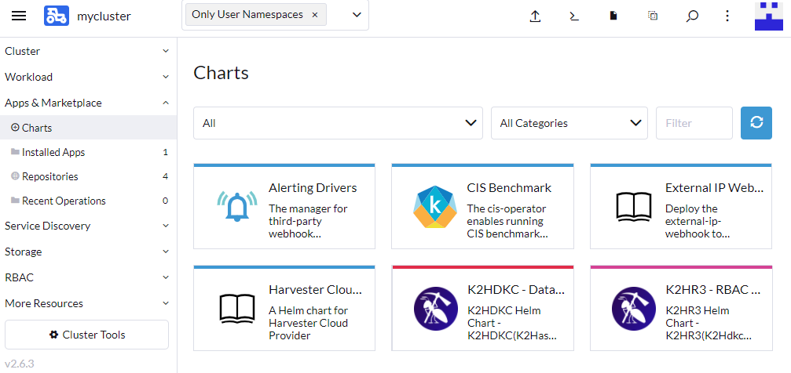
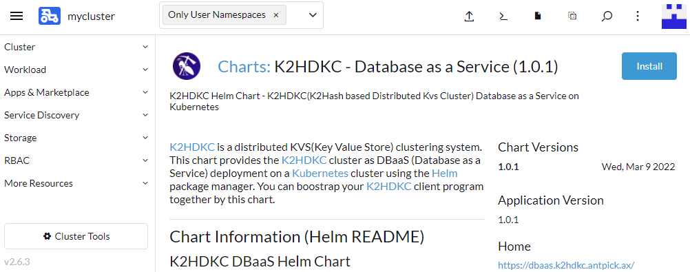
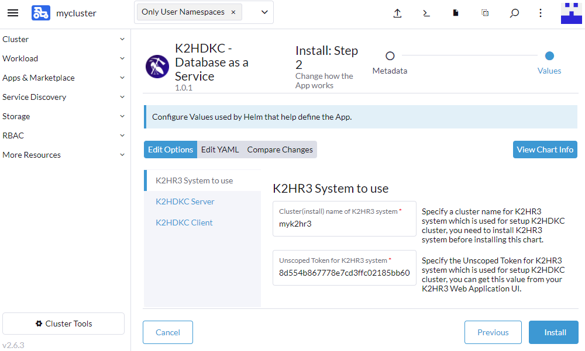
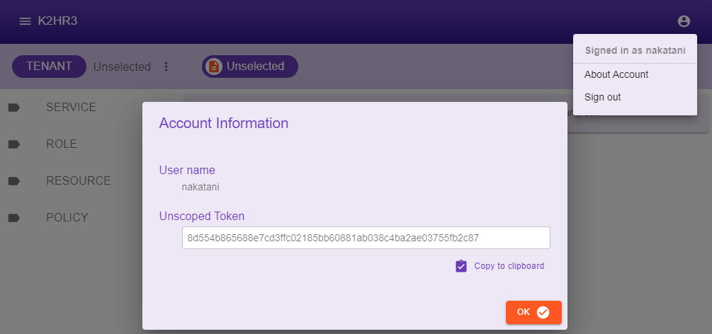
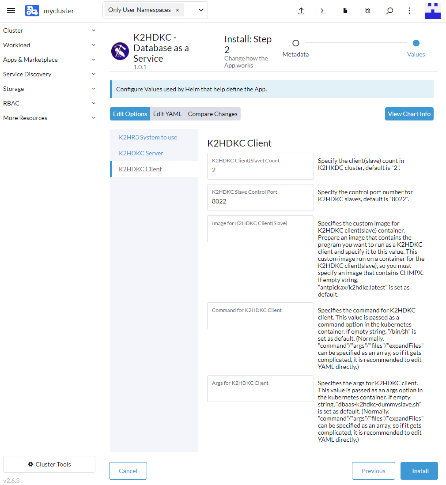
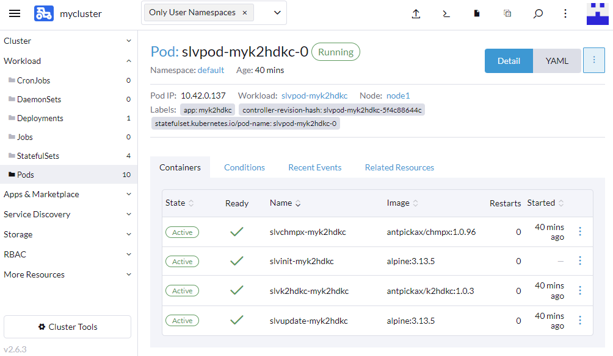

# RANCHER with Helm Chart
The **K2HDKC Helm Chart** is a **Helm Chart** for building a K2HDKC cluster using [Helm(The package manager for Kubernetes)](https://helm.sh/) in a [kubernetes](https://kubernetes.io/) environment.  
This **K2HDKC Helm Chart** can be used as **RANCHER Helm Chart** from [RANCHER](https://rancher.com/).  

## Overview
You can register **K2HDKC Helm Chart** as **RANCHER Helm Chart** into the repository in the [RANCHER](https://rancher.com/).  
Then you can easily build up your K2HDKC cluster from the chart registered in the [RANCHER](https://rancher.com/) repository.  

**K2HDKC Helm Chart** is published as a Chart repository at [K2HDKC Helm Chart repository](https://helm.k2hdkc.antpick.ax/) and [Artifact Hub](https://artifacthub.io/packages/helm/k2hdkc/k2hdkc).  

Using the [RANCHER](https://rancher.com/) UI, you can register the **K2HDKC Helm Chart** published in [Artifact Hub](https://artifacthub.io/packages/helm/k2hdkc/k2hdkc) as a repository.  
The source code for the K2HDKC Helm Chart is available on [k2hdkc_helm_chart - Github](https://github.com/yahoojapan/k2hdkc_helm_chart).  

### Using Helm command
The **K2HDKC Helm Chart** can be used as a regular **Helm Chart**.  
If you want to use `helm` command for **K2HDKC Helm Chart**, please refer to [here](usage_helm_chart.html).  

# Use with RANCHER
The procedure for using **K2HDKC Helm Chart** [RANCHER](https://rancher.com/) which is **multi-cluster orchestration platform for kubernetes** is explained below.  

The following explanation assumes that the [RANCHER](https://rancher.com/) environment has been set up.  
Please refer to [RANCHER](https://rancher.com/) for the setup.  

## Cluster in RANCHER
Determine the **cluster** of RANCHER on which to deploy the K2HDKC cluster by **K2HDKC Helm Chart**.  
You create a cluster as needed.  

The following figure logs in to the **RANCHER UI** and displays a list of clusters.  

  

The following steps will be described using **mycluster**.  

## Add repository
Select the RANCHER cluster(`mycluster`) to display the cluster setting page.  
Select `Apps & Marketplace` > ` Repositories` in the left pane to display the content shown below.  

  
(In the figure above, the same Antpickax product `K2HR3 Helm Chart` is already registered.)  

Click the **Create** button on this page to register the **K2HDKC Helm Chart** as a repository.  

Click the **Create** button to display the **Repository: Create** page shown below.  

  

In order to register **K2HDKC Helm Chart** as a repository, set the values in the following items(required).  

- Name  
Please input `k2hdkc`.
- Target  
Select `http(s) URL to an index generated by Helm`.
- index URL  
Enter `https://helm.k2hdkc.antpick.ax/`.

After setting the above values, click the **Create** button in this page.  

  

Now, as shown above **K2HDKC Helm Chart** has been registered as a RANCHER repository.  

## Chart installation
Then install **K2HDKC Helm Chart**.  

Select `Apps & Marketplace` > `Charts` in the left pane to see a list of available `Charts`.  

  

You can find the `K2HDKC` in this Chart list.  

Clicking on the `K2HDKC` in the list will take you to a page where you can install the **K2HDKC Helm Chart**.  

  

Click the **Install** button in the upper right to next step.  

### Chart Install : Step 1
The `Install: Step 1` page is displayed as shown below.  

  

In this step 1, enter the `Name` of the K2HDKC cluster you want to install.  
In the above example, `myk2hdkc` is entered for` Name`.  

After entering `Name`, click the **Next** button.  

### Chart Install : Step 2
The `Install: Step 2` page is displayed as shown below.  

  

In this step, set the following items:  
- Setting K2HR3 System to use
- Setting K2HDKC Cluster Server
- Setting K2HDKC Cluster Client(Slave)

Each setting items is explained below.  

#### K2HR3 System to be used
On the `Install: Step 2` page, select `Edit Option` and then `K2HR3 System to use` from the list.  

  

A K2HR3 System is required to build a K2HDKC cluster using the **K2HDKC Helm Chart**.  
In this setting, enter the information of the K2HR3 System to be used.  

The **K2HR3 System** to be used can be easily built using the [K2HR3 Helm Chart](https://k2hr3.antpick.ax/rancher_helm_chart.html) provided by the same [AntPickax](https://antpick.ax/).  
As with **K2HDKC Helm Chart**, [K2HR3 Helm Chart](https://k2hr3.antpick.ax/rancher_helm_chart.html) can also be used to build a K2HR3 System from [RANCHER](https://rancher.com/).  
Please refer to [K2HR3 Helm Chart with RANCHER](https://k2hr3.antpick.ax/rancher_helm_chart.html) to build the K2HR3 System **before** installing this K2HDKC cluster.  

In this setting, enter the following required items:  
- Cluster(install) name of K2HR3 system
- Unscoped Token for K2HR3 system

#### Cluster(install) name of K2HR3 system
In the [K2HR3 Helm Chart with RANCHER](https://k2hr3.antpick.ax/rancher_helm_chart.html) procedure, specify the `Name` of the K2HR3 System that you specified when you installed the K2HR3 System.  
In the example of [K2HR3 Helm Chart with RANCHER](https://k2hr3.antpick.ax/rancher_helm_chart.html), `myk2hr3` is specified.  

#### Unscoped Token for K2HR3 system
Sign in to the `K2HR3 Web Application` of your K2HR3 system and you specify the `Unscoped Token` of the user to this item.  

You can get the `Unscoped Token` by following the steps below:  
- Sign in to `K2HR3 Web Application`
- Click on the `Account Button` in the upper right and select `About Account`
- The `Account Information` dialog displays `Unscoped Token`

The `Account Information` dialog is shown below:  
  

After entering the required items, the setting of this `K2HR3 System to use` item is completed.  

#### K2HDKC Cluster Server
On the `Install: Step 2` page, select `Edit Option` and then `K2HDKC Client` from the list.  

  

In this setting, enter the information for the K2HDKC Cluster Server.  
For this setting, enter the following items, but they are not required.  
- K2HDKC Server Count
- K2HDKC Server Port
- K2HDKC Server Control Port
- Image Organaization name for K2HDKC
- Image version for K2HDKC
- Image Organaization name for CHMPX
- Image version for CHMPX

Please refer to the description of each item and set the value of the item you want to change.  

After entering the required items, the setting of this `K2HDKC Server` item is completed.  

#### K2HDKC Cluster Client(Slave)
On the `Install: Step 2` page, select `Edit Option` and then `K2HR3 REST API` from the list.  

  

In this setting, enter the information for the K2HDKC Cluster Client(Slave).  
For this setting, enter the following items, but they are not required.  
- K2HDKC Client(Slave) Count
- K2HDKC Slave Control Port
- Image for K2HDKC Client(Slave)
- Command for K2HDKC Client
- Args for K2HDKC Client

Please refer to the description of each item and set the value of the item you want to change.  

This setting has some items for the user's `client program` which runs on container.    
If you set these default values(no edit), the container for the K2HDKC client will do nothing.  
If you need to run your client program as a K2HDKC client on the container, you can deploy and launch your program by setting these items.  
The items for setting the user's client program are `Image for K2HDKC Client(Slave)`, `Command for K2HDKC Client` and `Args for K2HDKC Client`.  

For each item, refer to [here](https://k2hr3.antpick.ax/helm_chart.html) and set the value.  

In this explanation, do not enter (no edit) the above values and proceed with the defaults.  

After entering the required items, the setting of this `K2HDKC Client` item is completed.  

## Chart installed
The installation of **K2HDKC Helm Chart** will start, and when it is completed, the following screen(`Apps & Marketplace` > `Installed Apps`) will be displayed.

  

If you see the `Deployed` badge, you have successfully installed your K2HDKC cluster.  

### StatefulSets
Displays the `StatefulSets` installed by the **K2HDKC Helm Chart**.  
In the left pane, select `Workload` > `StatefulSets` to confirm.  

  

If you see `slvpod-myk2hdkc` and `svrpod-myk2hdkc`(case of `Name=myk2hdkc`) and the `Active` badge on the both of them, then `StatefulSets` is successful.  

### Pods
Displays the `Pods` installed by the **K2HDKC Helm Chart**.  
In the left pane, select `Workload` > `Pods` to confirm.  

  

If you see A total of 4 pods, `slvpod-myk2hdkc-[0,1]` and `svrpod-myk2hdkc-[0,1]`(case of `Name=myk2hdkc`) and the `Running` badge on the both of them, then `Pods` is successful.  

## Check K2HDKC cluster
Check the operation of the installed K2HDKC cluster.  

You can use the [RANCHER](https://rancher.com/) UI to check the operation.  
The following procedure launches a shell on the [RANCHER](https://rancher.com/) UI, and the shell runs in the client(slave) container which was built up.  

### Run Shell
First, select one pod of the started K2HDKC Client(Slave) and display its contents.  
From the Pods list view above, click one of the pod names(`slvpod- <name>-<number>`) for the K2HDKC Client(Slave).  
The following example displays the contents of `slvpod-myk2hdkc-0`.  

  

From the above container list, select the container(`slvk2hdkc-<name>`) for executing the client program.  
Click the button to the right of this container and select `Execute Shell` from the menu.  

  

When you select the menu above, the shell screen of the container will be displayed as shown in the screen below.  
Make sure you see the **shell prompt**(`/ # `) at the bottom of the screen.  

  

After this, run `k2hdkclinetool` on the shell and check the operation of the K2HDKC Cluster.  

#### k2hdkclinetool Test
After the `k2hdkclinetool` runs, execute the following **k2hdkclinetool command** to check `the status of the K2HDKC cluster`, `the status of the CHMPX cluster` and `read/write data`.  
Please refer to [here](https://k2hdkc.antpick.ax/k2hdkclinetool.html) for how to use `k2hdkclinetool`.  

- Run `k2hdkclinetool`  
```
/ # k2hdkclinetool -conf /etc/antpickax/slave.ini
    -------------------------------------------------------
     K2HDKC LINE TOOL
    -------------------------------------------------------
    K2HDKC library version          : 1.0.3
    K2HDKC API                      : C++
    Communication log mode          : no
    Debug mode                      : silent
    Debug log file                  : not set
    Print command lap time          : no
    Command line history count      : 1000
    Chmpx parameters:
        Configuration               : /etc/antpickax/slave.ini
        Control port                : 0
        CUK                         : 
        Permanent connect           : no
        Auto rejoin                 : no
        Join giveup                 : no
        Cleanup backup files        : yes
    -------------------------------------------------------
K2HDKC>
```

- Check the status of the K2HDKC cluster  
```
K2HDKC> status node
        K2HDKC server node count                       = 2
        <    chmpxid   >[<  base hash   >](      server name      ) : area element page (k2hash size/ file size )
        ----------------+-----------------+-------------------------:-----+-------+----+-------------------------
        1fa555daf4e4218f[0000000000000001](svrpod-myk2hdkc-1.svrsvc-myk2hdkc.default.svc.cluster.local) :   0%      0%   0% (298905600 / 298905600)
        1fa5578df4e4218f[0000000000000000](svrpod-myk2hdkc-0.svrsvc-myk2hdkc.default.svc.cluster.local) :   0%      0%   0% (298905600 / 298905600)
```

- Check the status of the CHMPX cluster  
```
K2HDKC> status chmpx
        ALL CHMPX STATUS(SIMPLE)
        
        chmpx process id             = 247
        random mode                  = no
        chmpx name                   = myk2hdkc
        self chmpx = {
          chmpxid                    = 0xf708ad7307a14571
          hostname                   = slvpod-myk2hdkc-0.slvsvc-myk2hdkc.default.svc.cluster.local
          mode                       = slave
          port                       = -1
          control port               = 8022
          cuk                        = eyJrOHNfY29udGFpbmVyX2lkIjoiODAxZTE1ZDg5NDRjNTg2ZmIw...
          custom id seed             = slvpod-myk2hdkc-0
          endpoints                  = 
          control endpoints          = 
          forward peers              = 
          reverse peers              = 
          ssl                        = no
          last status update time    = 27630419226733433 (unix time)
          status                     = SAFE -> [SLAVE][UP][n/a][Nothing][NoSuspend]
        }
        server chmpxs [ 2 ] = {
          [0] = {
            chmpxid                  = 0x1fa5578df4e4218f
            hostname                 = svrpod-myk2hdkc-0.svrsvc-myk2hdkc.default.svc.cluster.local
            mode                     = server
            port                     = 8020
            control port             = 8021
            cuk                      = eyJrOHNfY29udGFpbmVyX2lkIjoiOTI0NTY5OWE3NDFlZjU3MjVh...
            custom id seed           = svrpod-myk2hdkc-0
            endpoints                = 
            control endpoints        = 
            forward peers            = 
            reverse peers            = 
            ssl                      = yes
            last status update time  = 27630491553690831 (unix time)
            status                   = SAFE -> [SERVICE IN][UP][n/a][Nothing][NoSuspend]
          }
          [1] = {
            chmpxid                  = 0x1fa555daf4e4218f
            hostname                 = 10-42-1-64.slvsvc-myk2hdkc.default.svc.cluster.local
            mode                     = server
            port                     = 8020
            control port             = 8021
            cuk                      = eyJrOHNfY29udGFpbmVyX2lkIjoiMWQ3Nzg4NjMyNTJkN2EyYWU3...
            custom id seed           = svrpod-myk2hdkc-1
            endpoints                = 
            control endpoints        = 
            forward peers            = 
            reverse peers            = 
            ssl                      = yes
            last status update time  = 27630491553690831 (unix time)
            status                   = SAFE -> [SERVICE IN][UP][n/a][Nothing][NoSuspend]
          }
        }
        slave chmpxs [ 0 ] = {
        }
        chmpx using MQ               = 8
        client process using MQ      = 0
        assigned MQ                  = 0
```

- Check read/write data  
```
K2HDKC> set testkey testvalue
K2HDKC> print testkey
        "testkey" => "testvalue"
```

As above, if there is no problem in the state of the K2HDKC cluster and reading/writing data, the K2HDKC cluster has started normally.  

## Let's up K2HDKC cluster
Now you knew how to install a K2HDKC cluster using [RANCHER](https://rancher.com/) and **K2HDKC Helm Chart**.  

In the above example, we installed the K2HDKC cluster by setting only the required items, but we can customize it further.  
If you want to customize something other than what is shown in `Install: Step 2`, you can select `Edit YAML` and edit the value of `values.yaml` in **K2HDKC Helm Chart** directly.  

  

The values ​​you can change are the same as when customizing the **K2HDKC Helm Chart** using from the `helm` command.  
For the definition and default value of each variable, refer to [K2HDKC Helm Chart Option](usage_helm_chart.html).  

As described above, if you use **K2HDKC Helm Chart** as **RANCHER Helm Chart** in [RANCHER](https://rancher.com/), you can easily install a K2HDKC cluster.  
