# 使い方 - K2HDKC DBaaS with Trove
[Trove(Trove is Database as a Service for OpenStack)](https://wiki.openstack.org/wiki/Trove)と連携する**K2HDKC DBaaS with Trove** (Database as a Service for K2HDKC)の使い方を説明します。  
この **K2HDKC DBaaS with Trove** (Database as a Service for K2HDKC) は、[Trove(Trove is Database as a Service for OpenStack)](https://wiki.openstack.org/wiki/Trove) に組み込まれたシステムであるため、TroveのDashboardおよび[CLI（openstackコマンドなど）](https://docs.openstack.org/python-openstackclient/latest/) から操作します。  

ここでは、**K2HDKC DBaaS** でK2HDKCクラスターの作成、スケール、削除について、また自動化されたK2HDKCスレーブの起動・確認方法について説明します。  
以下の説明は、Trove Dashboard経由での操作説明になります。  
CLI（openstackコマンドなど）の使い方については、[Openstackのドキュメント](https://docs.openstack.org/python-openstackclient/latest/)などを参照してください。  

本章で説明する使い方は、**K2HDKC DBaaS** の[K2HDKC DBaaS with Trove 環境](buildja.html)を構築して、確認できます。  

以降の説明は、以下の順序で説明します。  
1. K2HDKC DBaaS with Trove 環境構築
2. Dashboardへのアクセスとログイン
3. プロジェクトの選択
4. K2HDKCクラスター情報（Configuration Group）
5. K2HDKCクラスター構築（2通りの構築方法）
6. K2HDKCスレーブノード（起動と確認）

## 1. K2HDKC DBaaS with Trove 環境構築
**K2HDKC DBaaS with Trove**を試すには、[Trove(Trove is Database as a Service for OpenStack)](https://wiki.openstack.org/wiki/Trove)の環境が必要となります。  
簡単に試用環境を作成する方法については、[K2HDKC DBaaS with Trove 環境構築](buildja.html)で説明します。

## 2. Dashboardへのアクセスとログイン
まず、TroveのDashboardへアクセスします。  
_試用環境をお使いの場合、Dashboardへアクセスするには、K2HDKC DBaaSを構築したホストへアクセス（`http://<hostname or ip address>`）してください。_  

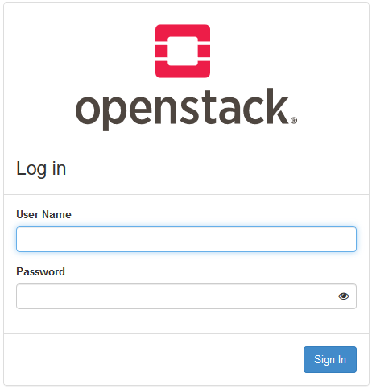

ログインが促されますので、利用するユーザのクレデンシャル（ユーザ名、パスフレーズ）でログインしてください。  
試用環境を利用している場合は、ユーザ名：`demo`でログインします。  
_試用環境のdemoユーザのパスフレーズは、`~/devstack/local.conf`ファイルの`ADMIN_PASSWORD`変数に登録されています。_  

ログインできたら、以下のような画面になります。  

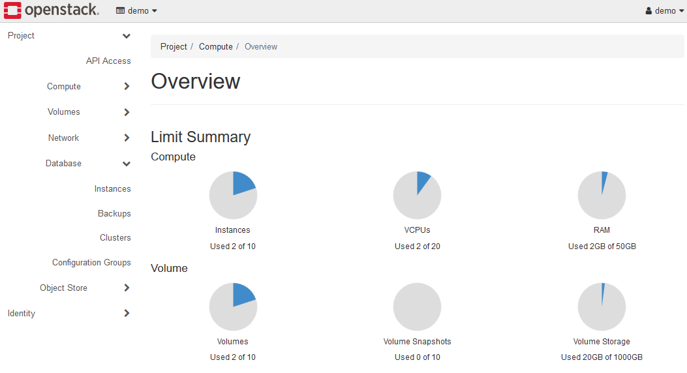

### 2-1. K2HR3システムへのログイン
**K2HDKC DBaaS** は、バックエンドでK2HR3システムを利用しています。  
**K2HDKC DBaaS** で利用するK2HR3システムにアクセスできるか確認をしてください。  
_試用環境をお使いの場合、K2HR3システムへアクセスするには、K2HDKC DBaaSを構築したホストからアクセス（`http://<hostname or ip address>:28080/`）できます。_  


_K2HDKCクラスターを起動・管理するために、K2HR3システムにアクセスする必要はありません。自動的なK2HDKCスレーブノードを起動するときにアクセスします。_  

K2HR3システムへのログインは、Trove Dashboardへログインするクレデンシャル（ユーザ名、パスフレーズ）と同じです。  


## 3. プロジェクトの選択
Dashboardにログインしたら、K2HDKCクラスターを管理するプロジェクトを選択してください。  
_試用環境を利用している場合は、プロジェクト名：`demo`を選択してください。_  


## 4. K2HDKCクラスター情報（Configuration Group）
**K2HDKC DBaaS** でK2HDKCクラスターを構成するときに、クラスターの設定を与えるために必要となる`Configuration Group`を作成します。  

以下の手順で作成してください。  

### 4-1. Configuration Groupの作成
Dashboardの`Database` > `Configuration Groups`を選択してください。  


`+Create Configuration Group`ボタンをクリックし、`Create Configuration Group`ダイアログを表示します。  

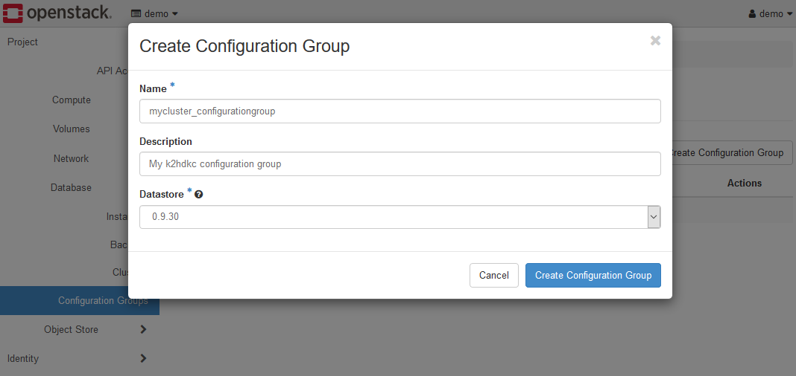

この例では、Name：`mycluster_configurationgroup`としています。  
`Create Configuration Group`ボタンをクリックして、`Configuration Group`を作成してください。  

### 4-2. Configuration Groupの設定
作成されたConfiguration Group：`mycluster_configurationgroup`が表示されますので、詳細を設定していきます。  

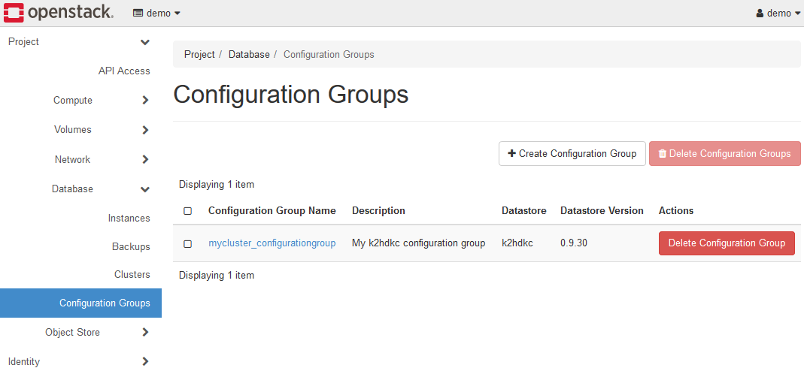

リンクをクリックすると、この`Configuration Group`のパラメータの設定画面に移動します。  

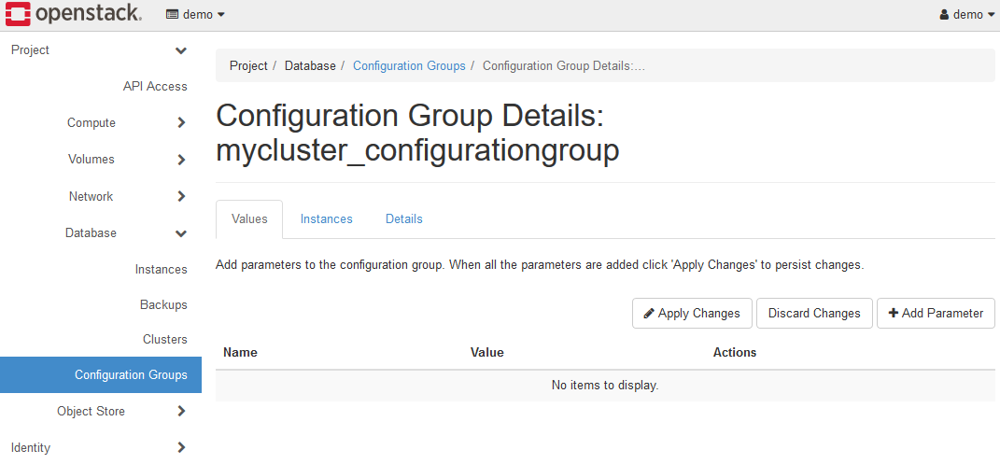

`+Add Parameter`ボタンをクリックして、`Add Parameter`ダイアログを表示します。  


**K2HDKC DBaaS** で設定する最低限のパラメータは、**cluster-name のみ** です。  
`cluster-name` パラメータ名を選択し、値を設定してください。  
この例では、`mycluster`としています。  
_`extdata-url`は**設定しない**でください。この値は自動的に設定されます。_  


以下は、`cluster-name` パラメータを設定した直後の画面イメージです。  

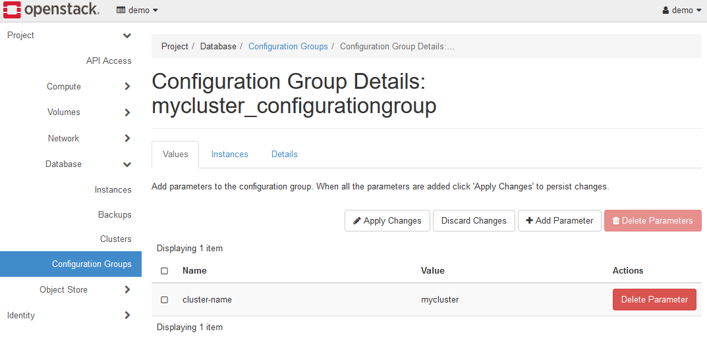

最後に、`Apply Changes`ボタンをクリックして、設定を反映させます。  


設定を反映させると、未指定だったパラメータもすべて自動的に補完されます。  
_特に理由がなければ、`cluster-name` パラメータのみの設定で十分です。_  

ここまでで、K2HDKCクラスター情報（`Configuration Group`）の設定が完了しました。  

## 5. K2HDKCクラスター構築
K2HDKCクラスターの構築には、**K2HDKC DBaaS** は**2通りの方法** を提供しています。  
ひとつは、クラスター名、サーバーノード数を指定して、クラスターを構築し、クラスターの拡張・縮小・削除ができます。  
もう一つは、クラスターのサーバーノードを個別に起動し、クラスターを構築する方法です。  

後者の場合は、バックアップおよびバックアップしたデータからサーバーノードの起動（リストア）ができます。  
基本的に、K2HDKCクラスターは、内部でサーバーノードが互いのデータを保持し、多重化されているため、バックアップおよびリストアの操作は不要です。  
都度クラスターの縮小・拡張でこの操作を代用できます。  

**K2HDKC DBaaS** では、データの多重化（サーバノードの多重化）を十分に行うことで、前者のクラスターの構築方法で安全に運用できます。  

### 5-1. K2HDKCクラスターの一括構築と操作
ここでは、前者のK2HDKCクラスターを一括で構築する手順を説明します。  

まず、`Database` > `Clusters` を開きます。  


`Launch Cluster`ボタンをクリックして、`Launch Cluster`ダイアログを表示し、各項目を設定してください。  

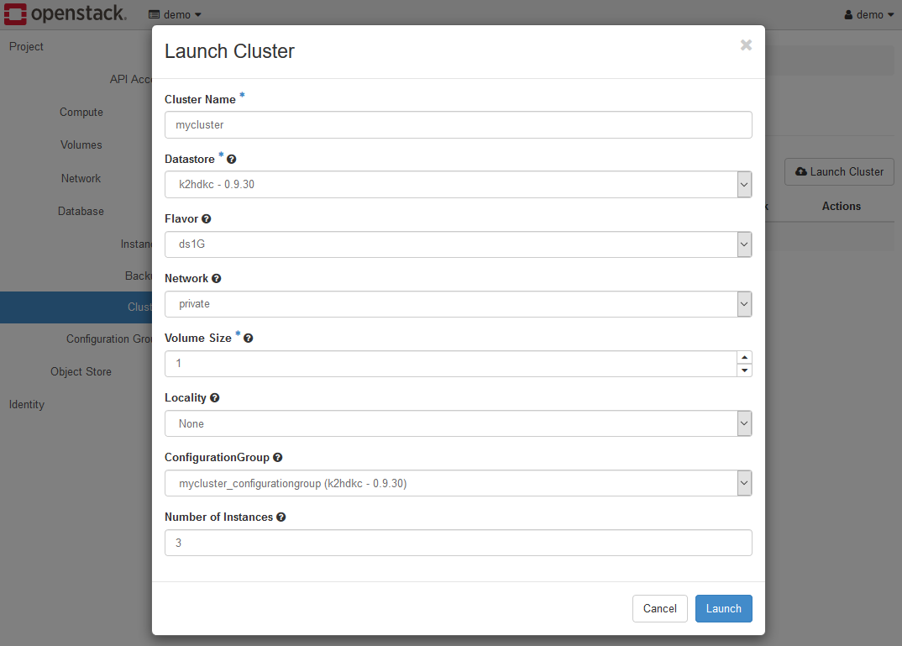

各項目は以下のように設定します。  
- Cluster Name  
この値は、K2HDKCクラスターのサーバーノードのHOST（Virtual Machine）の名前の一部分になります。上図では、`mycluster`としています。
- Datastore  
`k2hdkc - 0.9.30`などのように`TroveゲストOSイメージ`に付与された名前が一覧されますので、存在するものを選択してください。
- Flavor  
フレーバーを選択します。試用環境を使用している場合は、`ds1G`を選択してください。
- Network  
試用環境を使用している場合は、`private`を選択します。
- Volume Size  
試用環境を使用している場合は、`1`としてください。
- Locality  
試用環境を使用している場合は、`None`を選択します。
- ConfigurationGroup  
上記で作成した`Configuration Group`がリストされていますので、選択してください。ここまで手順通りに進めている場合、`mycluster_configurationgroup (k2hdkc-0.9.30)`を選択します。
- Number of Instances  
起動するK2HDKCクラスターのサーバノード数を指定します。デフォルトは`3`となっています。

上記の設定で、`Launch`ボタンをクリックすると、K2HDKCクラスターが起動します。  


起動したクラスターのメニューから、クラスターの拡張（`Grow Cluster`）、縮小（`Shrink Cluster`）、削除（`Delete Cluster`）が実行できます。  

#### 5-1-1. K2HDKCクラスターの状態
上述の`Cluster Name`のリンク（上図では`mycluster`）をクリックすると、K2HDKCクラスターのサーバーノードの状態を確認できます。  

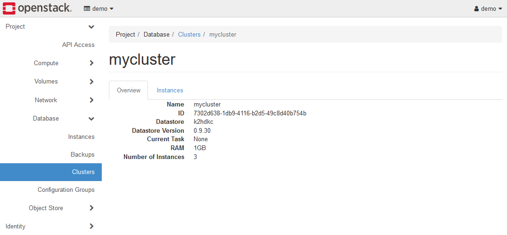

`Instances`タブを開くと、K2HDKCクラスターを構成するサーバノードの情報を表示できます。  


#### 5-1-2. K2HDKCクラスターの拡張
クラスターの拡張（`Grow Cluster`）メニューを選択し、K2HDKCクラスターを拡張（サーバーノードの追加）できます。  

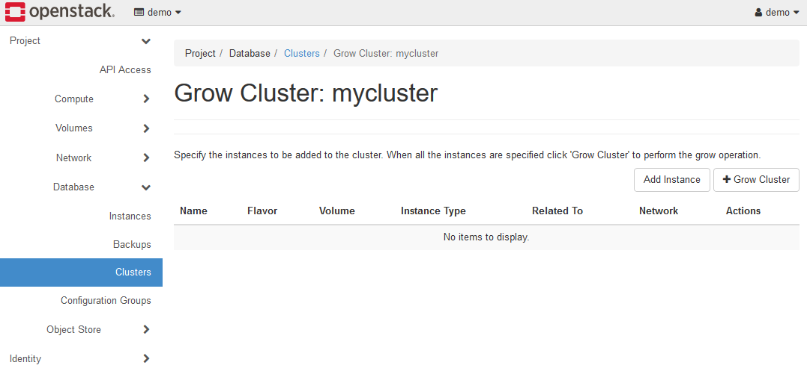

上記の`Add Instance`ボタンをクリックし、`Add Instance`ダイアログを表示し、各項目を設定します。  

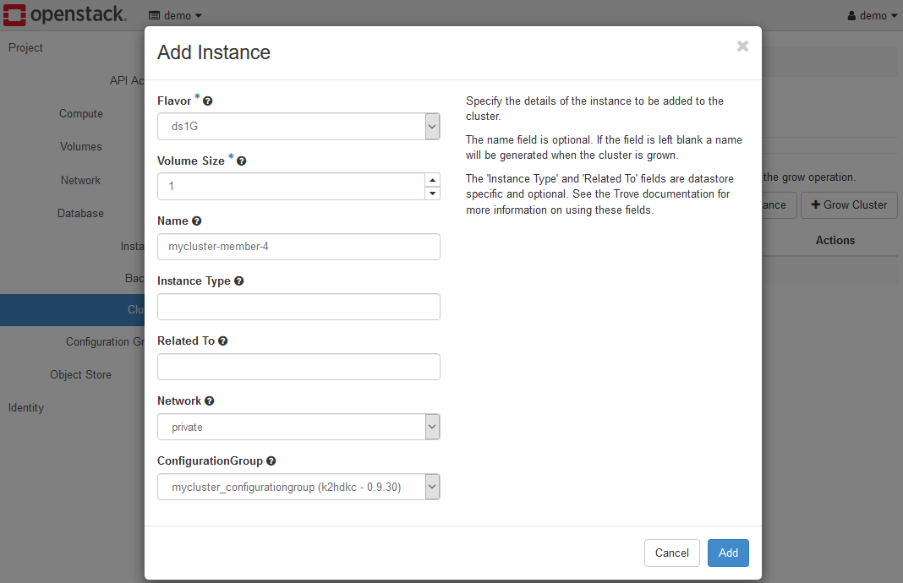

各項目は以下のように設定します。  
- Flavor  
フレーバーを選択します。他のサーバーノードと同じものを選択するようにします。
- Volume Size  
他のサーバーノードと同じものを選択するようにします。試用環境を使用している場合は、`1`としてください。
- Name  
この値は、追加するサーバーノードのHOST（Virtual Machine）の名前になります。上図では、既存サーバーノードと合わせて`mycluster-member-4`としています。
- Instance Type / Related To  
これらの値は入力する必要はありません。
- Network  
他のサーバーノードと同じものを選択するようにします。試用環境を使用している場合は、`private`を選択します。
- ConfigurationGroup  
他のサーバーノードと同じものを選択するようにします。ここまで手順通りの場合は、`mycluster_configurationgroup (k2hdkc-0.9.30)`を選択します。

上記の設定で、`Add`ボタンをクリックしてください。  
複数のサーバーノードを同時に追加する場合には、この`Add Instance`の作業を追加分繰り返してください。  


作業を完了すると、上図のようになります。  
この時点では、まだK2HDKCクラスターの拡張はされていません。  
つまり、拡張予定のサーバーノードの情報を準備した状態です。  

この画面にて、`+Grow Cluster`ボタンをクリックすることで、K2HDKCクラスターが拡張（サーバーノードの追加）されます。  

サーバーノードが追加された場合、K2HDKCクラスターは内部データの再配置を自動的に行います。（**オートデータマージ**）  
また、K2HDKCクラスターの構成管理も自動的に行われます。（**オートスケールアウト**）  
よって、ユーザはクラスターの拡張を指示するだけで、他の操作を行う必要はありません。  

#### 5-1-3. K2HDKCクラスターの縮小
クラスターの縮小（`Shrink Cluster`）メニューを選択し、K2HDKCクラスターを縮小（サーバーノードの削除）ができます。  


削除したいサーバーノードを選択し、`Shrink Cluster`ボタンをクリックしてください。  

サーバーノードが削除された場合、K2HDKCクラスターは内部データの再配置を自動的に行います。（**オートデータマージ**）  
また、K2HDKCクラスターの構成管理も自動的に行われます。（**オートスケールイン**）  
よって、ユーザはクラスターの縮小を指示するだけで、他の操作を行う必要はありません。  

#### 5-1-4. K2HDKCクラスターの削除
クラスターの削除（`Delete Cluster`）メニューを実行すると、K2HDKCクラスターが削除されます。  
K2HDKCクラスターを構成するサーバーノードはすべて削除されます。  

### 5-2. インスタンスからK2HDKCクラスター構築および操作
ここでは、K2HDKCクラスターをサーバーノードのインスタンスを個別に起動し、K2HDKCクラスターとして組み上げる手順を説明します。  

まず、`Database` > `Instances` を開きます。  

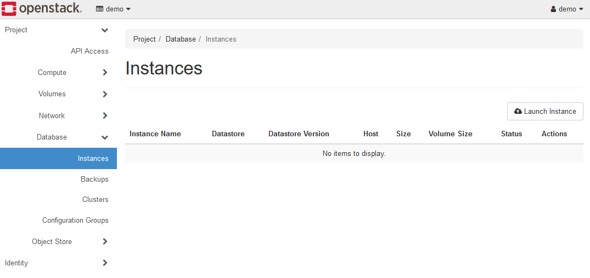

`Launch Instance`ボタンをクリックして、`Launch Instance`ダイアログを表示し、各項目を設定してください。  
`Launch Instance`ダイアログを表示すると、いくつかのタブに分割されていますので、各タブ毎に説明します。  

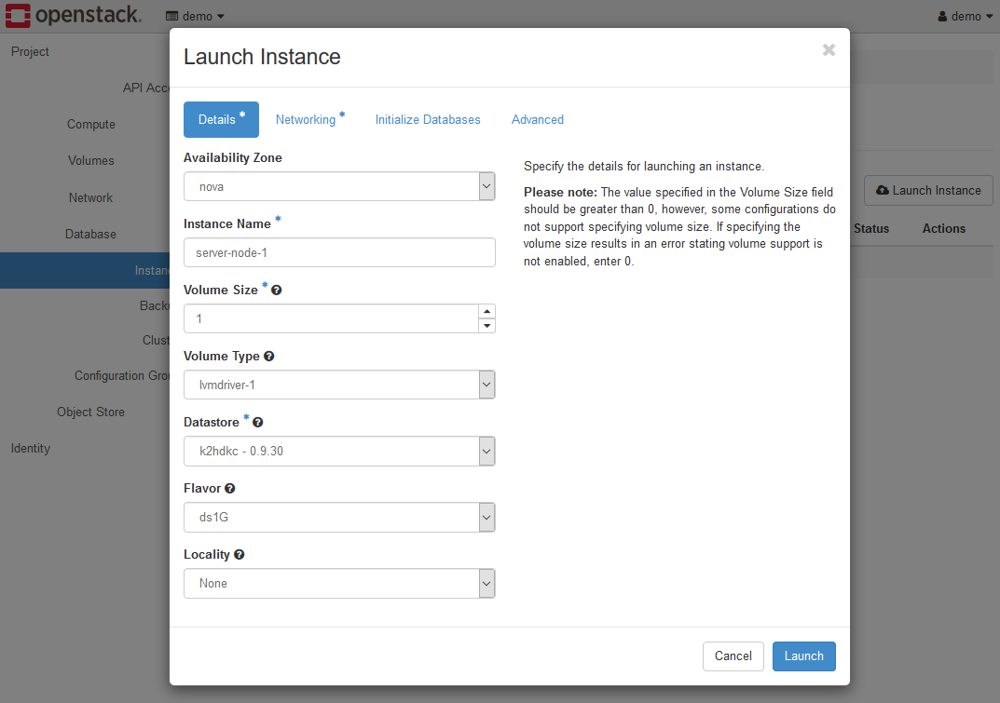

`Details`タブの各項目は以下のように設定します。  
- Availability Zone  
アベイラビリティゾーンを指定します。試用環境を使用している場合は、`nova`を選択します。
- Instance Nmame  
サーバーノードのインスタンスの名称を指定します。この例では、`server-node-1`としています。
- Volume Size  
試用環境を使用している場合は、`1`としてください。
- Volume Type  
試用環境を使用している場合は、`lvmdriver-1`を選択してください。
- Datastore  
`k2hdkc - 0.9.30`などのように`TroveゲストOSイメージ`に付与された名前が一覧されますので、存在するものを選択してください。
- Flavor  
フレーバーを選択します。試用環境を使用している場合は、`ds1G`を選択してください。
- Locality  
試用環境を使用している場合は、`None`を選択します。


`Networking`タブの各項目は以下のように設定します。  
- Selected Networks  
`private`が選択されている状態です。試用環境を使用している場合は、このままとします。

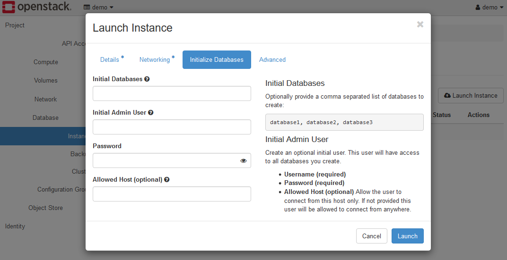

`Initializing Databases`タブの各項目は、未設定のままにしてください。  
_特に設定する必要な項目はありません。_  

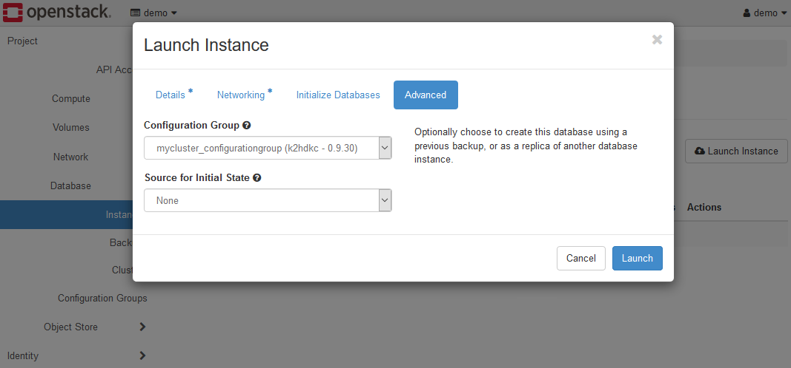

`Advanced`タブの各項目は以下のように設定します。  
- ConfigurationGroup  
手順通りの場合は、`mycluster_configurationgroup (k2hdkc-0.9.30)`を選択します。
- Source for initial state  
`None`のままとします。

上記の設定で、`Launch`ボタンをクリックすると、K2HDKCクラスター用のサーバーノードが1つ起動します。  
このように１つのサーバーノードが起動したら、K2HDKCクラスターに必要なサーバーノードを順次起動します。  
最終的に、３つのサーバーノードを起動した場合、以下の図のように表示されます。  


この状態は、3つのサーバーノードで構成されたK2HDKCクラスターを構築したことになります。  
この手順は、サーバーノードを順次起動し、K2HDKCクラスターの拡張を行いつつ、クラスターを構成できます。  

サーバーノードは順次追加されますが、K2HDKCクラスターは内部データの再配置を自動的に行いますので、データ操作は不要です。（**オートデータマージ**）  
また、自動的にK2HDKCクラスターの構成管理も行われます。（**オートスケールアウト**）  

上図`Instances`の各インスタンスにあるメニュー`Detach Configuration Group`を使い、インスタンスを起動したままK2HDKCクラスターからサーバーノードの登録を解除し、K2HDKCクラスターの縮小ができます。  
また、`Delete Instance`メニュー（もしくはボタン）は、そのインスタンスを削除（サーバーノードを削除）し、K2HDKCクラスターの縮小をします。  
`Create backup`メニューは、そのインスタンス（サーバーノード）の持つK2HDKCデータのバックアップを作成します。  
_これらの説明は後述します。_  
なお、`Resize Volume`、`Resize Instance`、`Manage Root Access`、`Restart Instance`メニューは、K2HDKC DBaaSでは使いません。  

#### 5-2-1. インスタンスの情報
インスタンス一覧の画面から、`Instance Name`をクリックすると、インスタンスの情報を表示できます。  

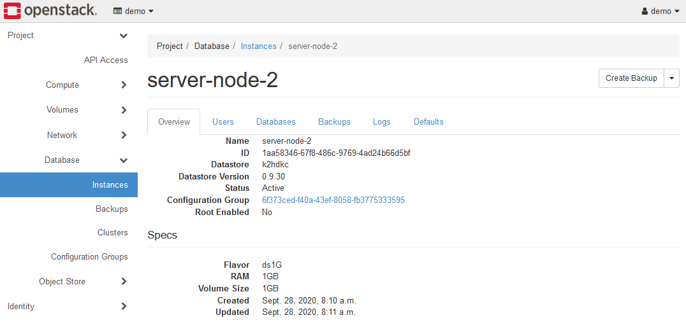

**K2HDKC DBaaS** では、`Overview`のみ機能します。  
_その他のタブは、分散KVSであるK2HDKCには不要な情報であり、機能しないようになっています。_  

`Overview`には、`Configuration Group`のIDが表示されています。  
インスタンスから構築されたサーバーノードが属するK2HDKCのクラスターを判別するには、`Configuration Group`の値を確認してください。  

#### 5-2-2. インスタンスをK2HDKCクラスターから削除
インスタンスをK2HDKCクラスターから削除（K2HDKCクラスターの縮小）を行う場合、`Detach Configuration Group`メニューを使います。  

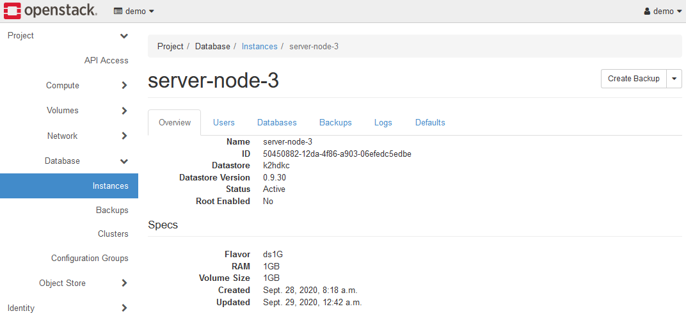

K2HDKCクラスターから削除（`Configuration Group`の解除）を実行したインスタンスは、上記のような状態となります。  
K2HDKCクラスターに組み込まれた（`Configuration Group`を設定）インスタンスと異なり、`Configuration Group`のIDが存在しなくなります。  

この状態のインスタンスは、K2HDKCのサーバーノードとして起動はしていますが、どのK2HDKCクラスターにも属していない状態です。  

この状態の場合、インスタンス一覧のメニュー項目が以下のようになっています。  


メニューは、`Detach Configuration Group`がなくなり、`Attach Configuration Group`に切り替わります。  

#### 5-2-3. インスタンスをK2HDKCクラスターに追加
前述のように、K2HDKCクラスターに属していないインスタンスをK2HDKCクラスターに追加することができます。  
この操作により、K2HDKCクラスターの拡張ができます。  

`Attach Configuration Group`メニューを選択すると、`Attach Configuration Group`ダイアログが開きます。  


`Configuration Group`項目の値に、拡張したいK2HDKCクラスターで使用している`Configuration Group`を選択してください。  
`Attach Configuration Group`ボタンをクリックすると、このインスタンスはK2HDKCクラスターに追加されます。  

#### 5-2-4. バックアップ
K2HDKCクラスターに属したインスタンスのバックアップを作成することができます。  
バックアップをとるインスタンスの`Create Backup`メニューを選択してください。  


`Backup Database`ダイアログが表示されますので、各項目を設定してください。  
- Name  
バックアップデータを区別する名前です。
- Database Instance  
バックアップするインスタンスを選択してください。
- Description  
バックアップデータに付与する付属情報を入力します。
- Parent Backup  
**K2HDKC DBaaS** では差分バックアップをサポートしていないので、未選択のままとしてください。

設定が完了したら、`Backup`ボタンをクリックします。  

バックアップが正常に作成されると、`Database` > `Backups` パネルに移動します。  


バックアップデータのリストが表示されます。  
この画面には、各バックアップに`Delete Backup`と`Restore Backup`のメニューがあります。  
また、バックアップをしたデータの`Name`をクリックすると、バックアップデータの詳細が表示されます。  


インスタンスのバックアップデータは、**K2HDKC DBaaS** が動作しているOpenStackコンポーネントの`Object Store`に保存されています。  
`Object Store` > `Containers`を開き、`k2hdkc backups`コンテナーを選択してください。  
_K2HDKC DBaaSの連携しているOpenStack環境により異なる場合があります。_  

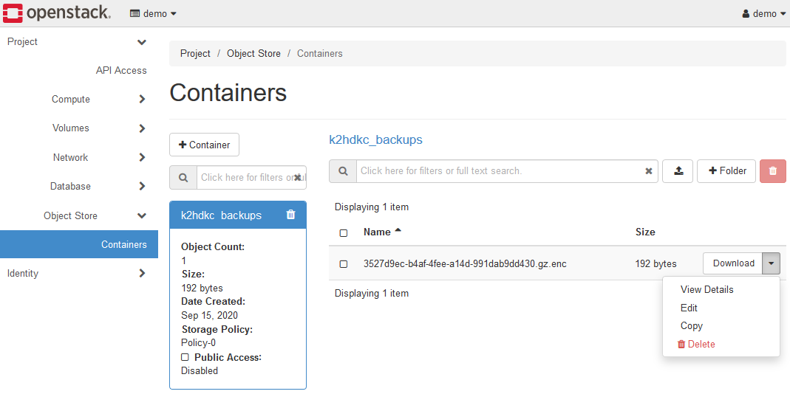

作成したバックアップのファイル（.gz.encファイル）がリストされています。  
このように、**K2HDKC DBaaS** で作成したバックアップは、`Object Store`に保存されています。  
`Object Store`の使い方などについては、OpenStackのドキュメントを参照してください。  
_[Swift](https://docs.openstack.org/swift/latest/)のドキュメントが参考になります。_  

#### 5-2-5. リストア
`Database` > `Backups` の画面に表示されているバックアップデータの`Restore Backup`メニューから、バックアップデータを指定してインスタンスを起動できます。  
インスタンスを構成し、初期データとしてバックアップデータをリストアした状態で、そのインスタンスを起動できます。  

リストアを実行すると、`Launch Instance`ダイアログが表示します。  
このリストア操作のインスタンス起動のためのダイアログは、上述したインスタンスの起動と`Advanced`タブを**除き**、同じです。  


上記は、`Launch Instance`ダイアログの`Advanced`タブです。  
`Advanced`タブの各項目は以下のように設定します。  
- ConfigurationGroup  
起動するインスタンスが属するK2HDKCクラスターと同じ`Configuration Group`を選択してください。
- Source for initial state  
`Restore from Backup`とします。
- Backup Name  
バックアップデータを選択してください。

`Details`、`Networking`、`Initialize Databases`のタブは、インスタンスの起動時と同様に設定してください。  

すべて設定後、`Launch`ボタンをクリックすると、バックアップデータをリストアした状態でインスタンスが起動します。  

## 6. K2HDKCスレーブノード
**K2HDKC DBaaS** で構築したK2HDKCクラスターにアクセスするK2HDKCスレーブノードについて説明します。  
_K2HDKCスレーブノードは、[K2HDKC](https://k2hdkc.antpick.ax/indexja.html)がサポートするOSで動作させてください。_  

**K2HDKC DBaaS** の機能を使うと、K2HDKCスレーブノードは、K2HDKCクラスターの構成に柔軟に対応できます。  
例えば、K2HDKCクラスターの拡張・縮小が行われた場合、その変更を自動で検知し、自動的にK2HDKCスレーブノードの設定を更新できます。（**オートコンフィグレーション**）  

**K2HDKC DBaaS** の機能を使ったK2HDKCスレーブノードの起動・操作を説明します。  

### 6-1. K2HR3からUser Data Script取得
**K2HDKC DBaaS** を使ったK2HDKCスレーブノードを起動するには、バックエンドで動作している[K2HR3](https://k2hr3.antpick.ax/indexja.html)システムを使います。  
_ここでは、試用環境として構築されたK2HDKC DBaaSの環境を前提として説明します。_  

**K2HDKC DBaaS** の機能を使ったK2HDKCスレーブノードを起動ためには、`User Data Script`が必要となります。  
以下の手順で、`User Data Script`をK2HR3システムから取り出します。  

#### 6-1-1. K2HR3ログイン
バックエンドで動作している[K2HR3](https://k2hr3.antpick.ax/indexja.html)システム にログインし、K2HDKCクラスターと同じプロジェクト（テナント）を選択してください。  
_試用環境を使っている場合は、ユーザ：`demo`でログインし、プロジェクト（テナント）：`demo`を選択します。_  


上記は、プロジェクト（テナント）の選択直後です。  

#### 6-1-2. ROLEトークンの生成
次に、`ROLE`を選択し、K2HDKCクラスターと同じ名前のROLE名を選択し、その中にある`slave`を選択してください。  
_試用環境を使い、上記までの手順でK2HDKCクラスターを作成した場合には、`ROLE` > `mycluster` > `slave`を選択します。_  


このROLEは、K2HDKCスレーブノード用のROLEになっています。  
この画面で、上部のツールバーにある`ROLE`ボタンをクリックします。  

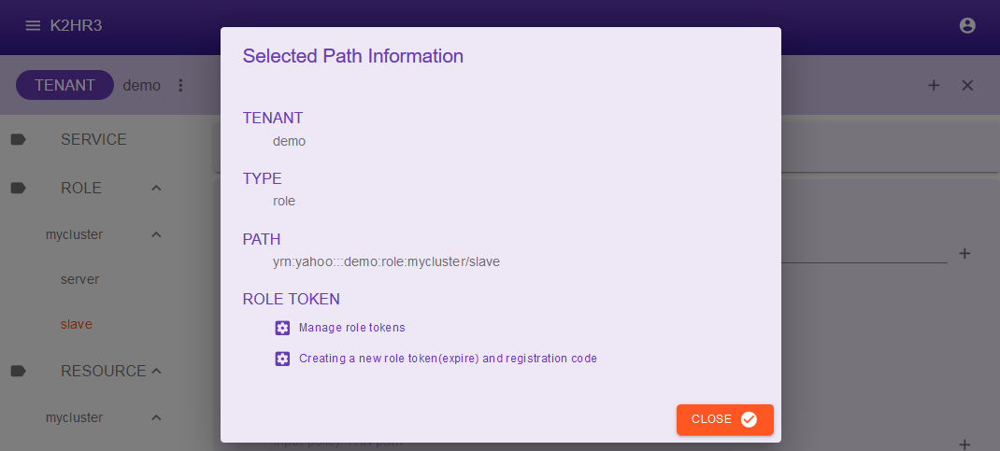

`Selected Path Information`ダイアログが表示されますので、`Manage role tokens`リンクをクリックしてください。  


このダイアログは、K2HR3が選択したROLE（`ROLE` > `mycluster` > `slave`）用に発行したROLEトークンの一覧を表示しています。  

新たにROLEトークンを発行します。  
_発行済みの場合は次の手順に進んでください。_  


`Action`文字の横にある`+`ボタンをクリックすると、上記の`CREATE NEW ROLE TOKEN`がポップアップします。  
このポップアップダイアログの中の、`Set the expiration date to the longest`チェックボックスをチェックし、`CREATE`ボタンをクリックしてください。  
_ROLEトークンの有効期限は、用途に応じて判断してください。_  


ROLEトークンが発行され、リストされます。  

#### 6-1-3. User Data Script取得
作成されたROLEトークン（もしくは既存のROLEトークン）の`Action`列にある2番目のボタンをクリックしてください。  

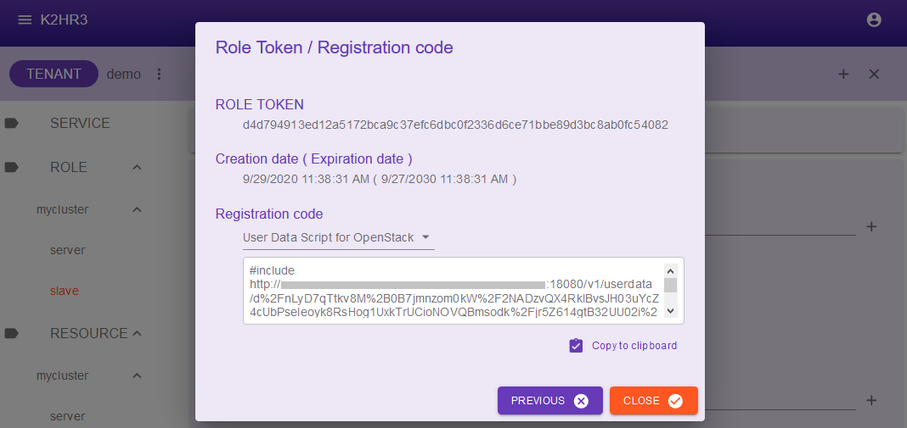

`Role token/Registration code`ダイアログが表示されます。  
`Registration code`プルダウンリストから`User Data Script for OpenStack`を選択してください。  
テキストボックスに、`User Data Script`の値が表示されますので、`Copy to clip board`ボタンなどを使い、内容をコピーしてください。  

### 6-2. K2HDKCスレーブノードの起動
`User Data Script`を使い、K2HDKCスレーブノードを起動します。  
K2HDKCスレーブノードの起動は、OpenStackの通常のインスタンスとして起動します。  

K2HDKCスレーブノードは、K2HDKCサーバーノードと通信をするために、専用の制御ポートを使用します。  
よって、インスタンスを起動するためにいくつかの事前設定が必要になります。  
以下の手順は、事前設定を含めた説明をします。  
_試用環境を使っている場合は、予め事前設定されているため、先の手順に進んでください。_  

手順を進めるにあたり、Dashboardからログインし、K2HDKCクラスターと同じプロジェクトを選択してください。  

#### 6-2-1. K2HDKCスレーブノード用事前設定
`Compute` > `Images` を開いてください。  
予めK2HDKCスレーブノードを起動するためのOSイメージが存在することを確認してください。  
_OSイメージは、[K2HDKC](https://k2hdkc.antpick.ax/indexja.html)がサポートするOSをお使いください。_  
試用環境を使っている場合は、`k2hdkc-dbaas-k2hr3-ubuntu-1804`というUbuntu 18.04のイメージが存在しますので、これを利用します。  


次に、K2HDKCスレーブノードがアクセスされる専用の制御ポートを許可するようにセキュリティグループを追加します。  


上記のように、TCP 8031ポートをANYのIngressで登録してください。  
このドキュメントの手順では、SSHログインをしますので、TCP 22(SSH)ポートも同様に登録します。  
なお、試用環境を使っている場合は、予め`k2hdkc-slave-sec`というセキュリティグループが登録されていますので、この登録は不要です。  

登録されたセキュリティグループは、`Network` > `Security Groups`で確認できます。  


以上で事前設定は完了となります。  

#### 6-2-2. K2HDKCスレーブノード起動
`Compute` > `instances` を選択してください。  
_`Database` > `Instances`ではないので、注意してください。_  

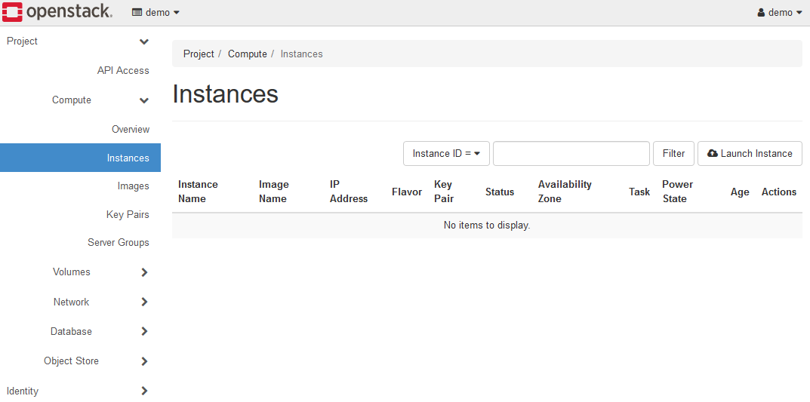

`Launch Instance`ボタンをクリックして、`Launch Instance`ダイアログを表示してください。  

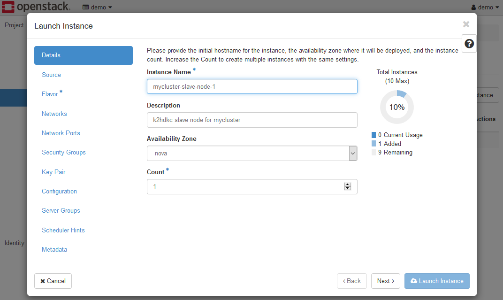

通常のインスタンス起動と同様に設定していきます。  
各ページのK2HDKCスレーブノードに関連する設定を以下に示します。  
- Details  
インスタンス名などを設定してください。特にK2HDKCスレーブノードに特化した項目はありません。
- Source  
K2HDKCスレーブノード用のOSイメージを選択してください。試用環境の場合は、`k2hdkc-dbaas-k2hr3-ubuntu-1804`を選択します。
- Flavor  
準備したOSイメージなどに応じて、フレーバーを選択してください。試用環境の場合は、`ds1G`を選択します。
- Networks  
環境に応じて設定してください。試用環境の場合は、`private`が選択されている状態にします。
- Security Groups  
K2HDKCスレーブノード用のセキュリティグループを選択してください。試用環境の場合は、`k2hdkc-slave-sec`を選択します。
- Key Pair  
ログインをする場合には設定してください。
- Network Ports / Server Groups / Scheduler Hints / Metadata  
環境に応じて設定してください。試用環境の場合は、未設定のままとします。
- Configuration  
K2HR3から取得した`User Data Script`の値を設定してください。

インスタンスの起動で重要なのは、`Configuration`ページの設定です。  
以下に示すように、K2HR3から取得した`User Data Script`の値を設定してください。  


全てを設定したら、`Launch`ボタンをクリックすると、インスタンスが起動します。  

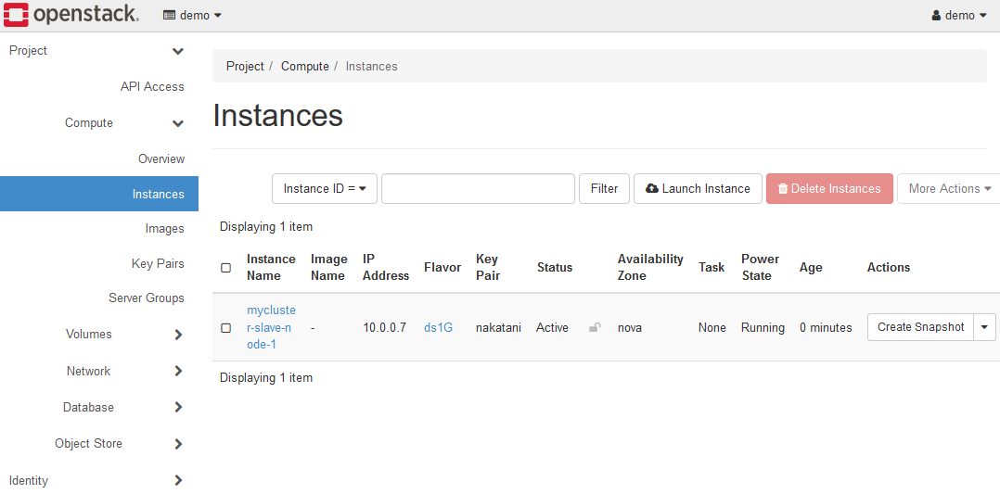

### 6-3. K2HDKCスレーブノードの確認
K2HDKCスレーブノード用のインスタンスが起動したら、K2HDKCスレーブノードを確認します。  
インスタンスは、K2HDKCスレーブノード用に以下の状態で起動されています。  

- K2HDKCスレーブノードとして必要となるプログラムがインストールされた状態
- K2HDKCスレーブノード用の設定ファイルとその自動更新サービスが登録された状態

ただし、インスタンスは起動していますが、K2HDKCスレーブノード用のプロセス等は何も起動していません。  
_設定ファイルの自動更新をするsystemd.serviceは登録・起動しています。_  

ここではK2HDKCスレーブノードのテストプロセスを起動し、K2HDKCクラスターとの接続を確認する方法を説明します。  
確認には、[CHMPX](https://chmpx.antpick.ax/indexja.html)と[K2HDKC](https://k2hdkc.antpick.ax/indexja.html)に含まれるツールを利用します。  
それらの利用方法については、それぞれのドキュメントを参照してください。  

以下の確認手順の前に、K2HDKCスレーブノードにログイン（SSH）してください。  

#### 6-3-1. 設定ファイルの確認
K2HDKCスレーブノード用のインスタンスが起動後、一定時間が経過すると以下のファイルが自動的に生成されます。  
このファイルは、[K2HR3](https://k2hr3.antpick.ax/indexja.html)システムから取得した`RESOURCEデータ`であり、このインスタンス専用のファイルです。  

- /etc/k2hdkc/slave.ini  
```
$ ls -la /etc/k2hdkc/slave.ini
-rw-r--r-- 1 root root 2015 Sep 29 05:08 /etc/k2hdkc/slave.ini
```

このファイルは、K2HDKCスレーブノードの設定ファイルであり、K2HDKCクラスターの拡張・縮小（サーバーノード数の変化）に応じて自動的に更新されます。（**オートコンフィグレーション**）  

#### 6-3-2. CHMPXプロセス起動
K2HDKCサーバーノードとの接続は、[CHMPX](https://chmpx.antpick.ax/indexja.html)プログラムが行います。  
[CHMPX](https://chmpx.antpick.ax/indexja.html) のパッケージは、インスタンス起動時にインストールされています。  

K2HDKCクラスター（複数のサーバーノード）とこのインスタンス（スレーブノード）が正常に通信できるか確認します。  
確認には、`chmpxlinetool`コマンドを使います。  
```
$ sudo chmpxlinetool -conf /etc/k2hdkc/slave.ini
-------------------------------------------------------
CHMPX CONTROL TOOL
-------------------------------------------------------
 CHMPX library version          : 1.0.83
 Debug level                    : Error
 Chmpx library debug level      : Silent
 Print command lap time         : no
 Command line history count     : 1000
 Chmpx nodes specified type     : configuration file/json
    Load Configuration          : /etc/k2hdkc/slave.ini
-------------------------------------------------------
 Chmpx nodes information at start
-------------------------------------------------------
 Chmpx server nodes             : 3
 {
    [0] = {
        Chmpxid                 : 0x33ccc90bc9f9ff25
        Hostname                : host-10-0-0-19.openstacklocal
        Control Port            : 8021
        CUK                     : 93fb0cf2-e336-4b8a-9ed9-4d53e1903503
        Control Endpoints       :
        Custom ID Seed          : server-node-2.novalocal
    }
    [1] = {
        Chmpxid                 : 0x5c98c2baab77d132
        Hostname                : host-10-0-0-46.openstacklocal
        Control Port            : 8021
        CUK                     : cfd6fcc4-cd7f-4ba2-852e-c517dfce1913
        Control Endpoints       :
        Custom ID Seed          : server-node-1.novalocal
    }
    [2] = {
        Chmpxid                 : 0xc1bfd6fc9974f778
        Hostname                : host-10-0-0-52.openstacklocal
        Control Port            : 8021
        CUK                     : 3c82ebee-1d8d-4d1c-b6eb-691a05c4c0b0
        Control Endpoints       :
        Custom ID Seed          : server-node-3.novalocal
    }
 }
 Chmpx slave nodes              : 1
 {
    [0] = {
        Chmpxid                 : 0x0ad1f1a4b41b8dfd
        Hostname                : 10.0.0.10
        Control Port            : 8031
        CUK                     : 03c5220e-67a7-4e5f-9a8b-8ae746a08497
        Control Endpoints       :
        Custom ID Seed          : mycluster-slave-node-1
    }
 }
-------------------------------------------------------
CLT> check
OK   10.0.0.19:8021:93fb0cf2-e336-4b8a-9ed9-4d53e1903503:server-node-2.novalocal: = {
    status            = [SERVICE IN] [UP]    [n/a]    [Nothing][NoSuspend]
    hash(pending)     = 0x1(0x1)
    sockcount(in/out) = 1/1
    lastupdatetime    = 2020-09-29 04h 11m 43s 431ms 284us(26866240190846132)
}
OK   10.0.0.46:8021:cfd6fcc4-cd7f-4ba2-852e-c517dfce1913:server-node-1.novalocal: = {
    status            = [SERVICE IN] [UP]    [n/a]    [Nothing][NoSuspend]
    hash(pending)     = 0(0)
    sockcount(in/out) = 1/1
    lastupdatetime    = 2020-09-29 05h 28m 06s 69ms 395us(26866317080465171)
}
OK   10.0.0.52:8021:3c82ebee-1d8d-4d1c-b6eb-691a05c4c0b0:server-node-3.novalocal: = {
    status            = [SERVICE IN] [UP]    [n/a]    [Nothing][NoSuspend]
    hash(pending)     = 0x2(0x2)
    sockcount(in/out) = 1/1
    lastupdatetime    = 2020-09-29 04h 11m 43s 682ms 946us(26866240191097794)
}

CLT> exit
Quit.
```
上記のように`chmpxlinetool`を起動し、そのコマンドプロンプトに`check`と入力します。  
全ての結果が、`OK`であれば、問題なく通信できます。  

確認が終わったら、[CHMPX](https://chmpx.antpick.ax/indexja.html) プログラムを起動します。  
以下のようにして起動します。  
```
$ sudo chmpx -conf /etc/k2hdkc/slave.ini &
```
正常に起動するとK2HDKCサーバーノードと通信できるようになります。  

#### 6-3-3. テストプログラムの起動
K2HDKCクラスターと通信し、スレーブノード上でK2HDKCの動作を確認するため、`k2hdkclinetool`テストプログラムを使います。  
このプログラムは、[K2HDKC](https://k2hdkc.antpick.ax/indexja.html)パッケージに属しており、インスタンスの起動時にインストールされています。  

以下のように`k2hdkclinetool`を起動します。  
```
$ sudo k2hdkclinetool -conf /etc/k2hdkc/slave.ini
-------------------------------------------------------
 K2HDKC LINE TOOL
-------------------------------------------------------
K2HDKC library version          : 0.9.30
K2HDKC API                      : C++
Communication log mode          : no
Debug mode                      : silent
Debug log file                  : not set
Print command lap time          : no
Command line history count      : 1000
Chmpx parameters:
    Configuration               : /etc/k2hdkc/slave.ini
    Control port                : 0
    CUK                         :
    Permanent connect           : no
    Auto rejoin                 : no
    Join giveup                 : no
    Cleanup backup files        : yes
-------------------------------------------------------
K2HDKC>
```
コマンドプロンプトに、`status node`と入力してください。  
```
K2HDKC> status node
K2HDKC server node count                       = 3
<    chmpxid   >[<  base hash   >](      server name      ) : area element page (k2hash size/ file size )
----------------+-----------------+-------------------------:-----+-------+----+-------------------------
33ccc90bc9f9ff25[0000000000000001](10.0.0.19              ) :   0%      0%   0% (298905600 / 298905600)
5c98c2baab77d132[0000000000000000](10.0.0.46              ) :   0%      0%   0% (298905600 / 298905600)
c1bfd6fc9974f778[0000000000000002](10.0.0.52              ) :   0%      0%   0% (298905600 / 298905600)
```
K2HDKCクラスターのサーバーノードの情報を表示できます。  

最後に、データの読み書きのテストをします。  
```
K2HDKC> set test-key test-value
K2HDKC> print test-key
"test-key" => "test-value"
```
`kest-key`を書き込み、それを読み出せたら、このインスタンスは問題なくK2HDKCスレーブノードとして利用できます。  

以上で、正常にK2HDKCクラスターと接続したK2HDKCスレーブノードの動作確認の完了です。  
